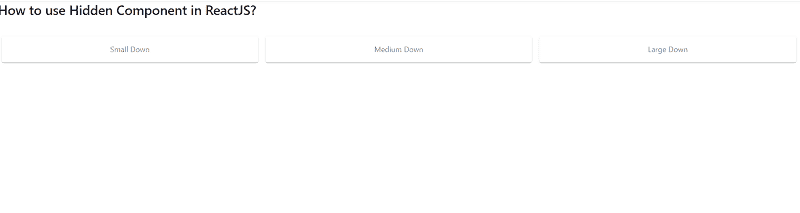

# 如何在 ReactJS 中使用隐藏组件？

> 原文:[https://www . geeksforgeeks . org/如何使用隐藏组件 in-reactjs/](https://www.geeksforgeeks.org/how-to-use-hidden-component-in-reactjs/)

**【隐藏】** 组件快速响应切换组件的可见性值和更多隐藏的实用程序。React 的 Material UI 有这个组件可供我们使用，非常容易集成。我们可以使用以下方法在 ReactJS 中使用隐藏组件。

**创建反应应用程序并安装模块:**

**步骤 1:** 使用以下命令创建一个反应应用程序:

```
npx create-react-app foldername
```

**步骤 2:** 创建项目文件夹(即文件夹名**)后，使用以下命令移动到该文件夹中:**

```
cd foldername
```

**步骤 3:** 创建 ReactJS 应用程序后，使用以下命令安装 **material-ui** 模块:

```
npm install @material-ui/core
```

**项目结构:**如下图。


项目结构

**文件名-App.js:** 现在在 **App.js** 文件中写下以下代码。在这里，App 是我们编写代码的默认组件。

## java 描述语言

```
import React from 'react';
import { makeStyles } from '@material-ui/core/styles';
import Hidden from '@material-ui/core/Hidden';
import Paper from '@material-ui/core/Paper';

const App = () => {

  const useStyles = makeStyles((theme) => ({
    paper: {
      flex: '1 0 auto',
      margin: theme.spacing(1),
      padding: theme.spacing(2),
      color: theme.palette.text.secondary,
      textAlign: 'center',
    },
  }));

  const classes = useStyles();

  return (
    <div style={{
      display: 'flex',
      flexWrap: 'wrap',
    }}>
      <div style={{ width: '100%', float: 'left' }}>
        <h3>How to use Hidden Component in ReactJS?</h3> <br />
      </div>
      <Hidden mdDown>
        <Paper className={classes.paper}>Small Down</Paper>
      </Hidden>
      <Hidden smDown>
        <Paper className={classes.paper}>Medium Down</Paper>
      </Hidden>
      <Hidden xsDown>
        <Paper className={classes.paper}>Large Down</Paper>
      </Hidden>
    </div>
  );
}

export default App;
```

**运行应用程序的步骤:**从项目的根目录使用以下命令运行应用程序:

```
npm start
```

**输出:**现在打开浏览器，转到***http://localhost:3000/***，会看到如下输出:



现在你开始缩小你的窗口，你会注意到第一个框将被隐藏，接下来是两个。这就是**隐藏**组件在 ReactJS 中的工作方式。