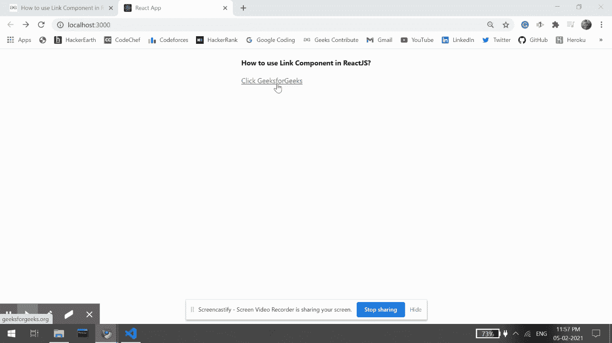

# 如何在 ReactJS 中使用链接组件？

> 原文:[https://www . geeksforgeeks . org/how-用法-link-in-component-reactjs/](https://www.geeksforgeeks.org/how-to-use-link-component-in-reactjs/)

链接组件允许您使用我们的自己的主题颜色和排版样式轻松定制锚点元素。【React 的 Material UI 有这个组件可供我们使用，非常容易集成。我们可以使用以下方法在 ReactJS 中使用链接组件:

**创建反应应用程序并安装模块:**

**步骤 1:** 使用以下命令创建一个反应应用程序:

```jsx
npx create-react-app foldername
```

**步骤 2:** 在创建项目文件夹(即文件夹名**)后，使用以下命令将**移动到该文件夹:

```jsx
cd foldername
```

**步骤 3:** 创建 ReactJS 应用程序后，使用以下命令安装 **material-ui** 模块:

```jsx
npm install @material-ui/core
```

**项目结构:**如下图。


项目结构

**App.js:** 现在在 **App.js** 文件中写下以下代码。在这里，App 是我们编写代码的默认组件。

## java 描述语言

```jsx
import React from "react";
import Link from "@material-ui/core/Link";

const App = () => {
  const preventDefault = (event) => event.preventDefault();

  return (
    <div
      style={{
        margin: "auto",
        display: "table",
      }}
    >
      <h4>How to use Link Component in ReactJS?</h4>
      <Link
        href="http://geeksforgeeks.org/"
        onClick={() => {
          alert("Redirecting to GeeksforGeeks");
        }}
      >
        Click GeeksforGeeks
      </Link>
    </div>
  );
};

export default App;
```

**运行应用程序的步骤:**从项目的根目录使用以下命令运行应用程序:

```jsx
npm start
```

**输出:**现在打开浏览器，转到***http://localhost:3000/***，会看到如下输出:

