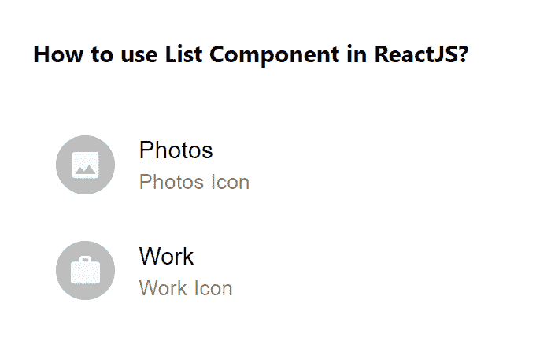

# 如何在 ReactJS 中使用列表组件？

> 原文:[https://www . geeksforgeeks . org/如何使用列表-reactjs 中的组件/](https://www.geeksforgeeks.org/how-to-use-list-component-in-reactjs/)

列表是文本或图像的连续垂直索引。【React 的 Material UI 有这个组件可供我们使用，非常容易集成。我们可以使用下面的方法在 ReactJS 中使用列表组件。

**创建反应应用程序并安装模块:**

**步骤 1:** 使用以下命令创建一个 React 应用程序。

```jsx
npx create-react-app foldername
```

**步骤 2:** 在创建项目文件夹(即文件夹名**)后，使用以下命令移动到该文件夹。**

```jsx
cd foldername
```

**步骤 3:** 创建 ReactJS 应用程序后，使用以下命令安装 **material-ui** 模块。

```jsx
npm install @material-ui/core
npm install @material-ui/icons
```

**项目结构:**如下图。


项目结构

**示例:**现在在 **App.js** 文件中写下以下代码。在这里，App 是我们编写代码的默认组件。

## App.js

```jsx
import React from 'react';
import ListItemAvatar from '@material-ui/core/ListItemAvatar';
import ListItemText from '@material-ui/core/ListItemText';
import Avatar from '@material-ui/core/Avatar';
import WorkIcon from '@material-ui/icons/Work';
import ListItem from '@material-ui/core/ListItem';
import ImageIcon from '@material-ui/icons/Image';
import List from '@material-ui/core/List';

export default function App() {

  return (
    <div style={{ display: 'block', padding: 30 }}>
      <h4>How to use List Component in ReactJS?</h4>
      <List>
      <ListItem>
        <ListItemAvatar>
          <Avatar><ImageIcon /></Avatar>
        </ListItemAvatar>
        <ListItemText primary="Photos" 
        secondary="Photos Icon" />
      </ListItem>
      <ListItem>
        <ListItemAvatar>
          <Avatar><WorkIcon /></Avatar>
        </ListItemAvatar>
        <ListItemText primary="Work" 
        secondary="Work Icon" />
      </ListItem>
    </List>
    </div>
  );
}
```

**运行应用程序的步骤:**从项目的根目录使用以下命令运行应用程序。

```jsx
npm start
```

**输出:**现在打开浏览器，转到***http://localhost:3000/***，会看到如下输出。



**参考:**T2】https://material-ui.com/components/lists/