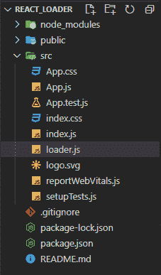

# 如何通过 npm 使用 react-loader-spinner 来使用加载动画？

> 原文:[https://www . geeksforgeeks . org/如何通过 npm 使用反应加载器旋转器加载动画/](https://www.geeksforgeeks.org/how-to-use-loading-animation-by-using-the-react-loader-spinner-through-npm/)

**微调器** 指示加载状态。我们也可以修改外观，尺寸，和旋转器的位置，与反应加载器旋转器中可用的属性类型。反作用加载器旋转器是一个 npm 包，其  提供  一个简单而有吸引力的 SVG 旋转器组件，可用于您的任何项目。这个套餐每周有超过 75k+的下载量。

这里对于加载器，我们将使用名为**反应-加载-旋转器**的 npm 包。这是装载机的包装。如需深入了解，您可以访问以下链接。

> https://www.npmjs.com/package/react-loader-spinner

**语法:**

```jsx
<Loader
  type="Spinner Type"
  color="rgb color"
  height={number}
  width={number}
  timeout={number in ms}
/>;
```

**旋转器的类型:**所有类型的旋转器都可以使用，类似地你只需要改变装载机的类型。

*   **音频**
*   **球三角**
*   **条形**
*   **圆圈**
*   **网格**
*   **红心**
*   **椭圆形**
*   **泡芙**
*   **铃声**
*   **尾旋**
*   **三点式**

**道具类型:**所有类型的旋转器都接受这些道具。

*   **可见:**是定义微调器是否可见的布尔值，默认值为假。
*   **类型:**这个道具定义了微调器类型。
*   **高度:**该道具定义了 SVG 微调器的高度，默认值为 80。
*   **宽度:**这个道具定义了 SVG 微调器的宽度，默认值是 80。
*   **颜色:**这个道具定义了旋转器的颜色。
*   **二级颜色:**这个道具在飞机和变点装载机上都有。
*   **超时:**此定义微调器的有效时间。
*   **半径:**这个道具设置旋转器的半径。

**创建反应应用程序并安装模块:**

**步骤 1:** 使用命令创建 React 应用程序。

```jsx
npx create-react-app foldername 
```

**第 2 步:**现在使用这个命令进入你的项目文件夹，即 foldername。

```jsx
cd foldername
```

**步骤 3:** 现在将包安装到项目文件夹中。

```jsx
npm install react-loader-spinner
```

**步骤 4:** 现在在你的 src 文件夹中创建一个新文件，即 loader.js

**项目结构:**会是这样的。这里我们的文件夹名是 react_loader。



**示例:**在本例中，我们将创建一个加载微调器，为此，我们已经创建了一个名为 loader.js 的组件文件，我们将把 loader . js 文件调用到我们的主渲染文件 App.js 中

App.js