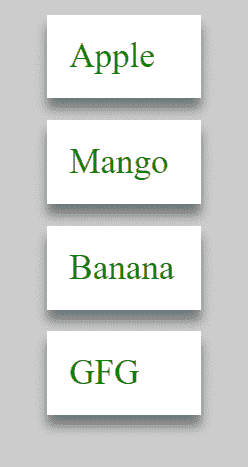

# 如何在 ReactJS 中使用 map()创建列表？

> 原文:[https://www . geeksforgeeks . org/如何使用地图创建列表 in-reactjs/](https://www.geeksforgeeks.org/how-to-use-map-to-create-lists-in-reactjs/)

JavaScript 中的数组有太多的函数可以使用。map()就是这样一个函数，它通过在数组的每个元素上调用一个函数来创建一个对象列表。在 React 中，我们可以使用 map()函数将值列表映射到组件列表。

让我们看看如何使用一个简单的项目创建一个列表。该项目有一个水果名称列表，我们将它们更改为浏览器中呈现的组件列表。

**创建反应应用程序并安装模块:**

*   **步骤 1:** 使用以下命令创建一个反应应用程序:

    ```
    npx create-react-app listmapdemo
    ```

*   **第 2 步:**创建项目文件夹后，即 listmapdemo】，使用以下命令移动到该文件夹:

    ```
    cd listmapdemo
    ```

**项目结构:**如下图。


项目结构

**示例:**在使用地图创建组件时，react 期望将一个关键道具传递给正在构建的每个组件。如果没有传递密钥，它仍然会呈现，但是您会在控制台中看到来自 React 的警告。在 App.js 文件中，我们定义了一个水果列表，然后映射到一个 div 列表。

## App.js

```
import React from "react"

function App() {

  // Declared an array of items
  const fruits = [
    'Apple',
    'Mango',
    'Banana',
    'GFG'
  ];

  // Some styling for the items
  const styles = {
    backgroundColor: 'white',
    width: '50px',
    marginBottom: '10px',
    padding: '10px',
    color: 'green',
    boxShadow: 'rgb(0,0,0,0.44) 0px 5px 5px',
  };

  return <>
    {
      /*  This maps each array item to a div adds
      the style declared above and return it */
      fruits.map(fruit => <div key={fruit} 
            style={styles}>{fruit}</div>)
    }
  </>;
}

export default App;
```

**运行应用程序的步骤:**从项目的根目录使用以下命令运行应用程序:

```
npm start
```

**输出:**现在打开浏览器，转到***http://localhost:3000/***，会看到如下输出:



**说明:**我们声明了一个将用于渲染草皮的水果列表。**样式**对象包含每个项目的 CSS 样式，它只是添加了一些边距、填充和一些阴影。最后，App 函数返回一个 div 列表，这些 div 是通过调用水果数组上的 map()返回的。我们在每个 div 的**样式**属性中添加了**样式**对象。