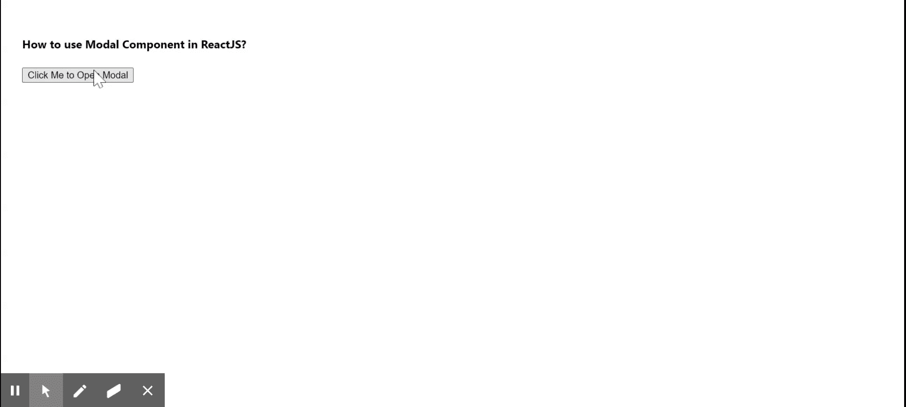

# 如何在 ReactJS 中使用模态组件？

> 原文:[https://www . geesforgeks . org/how-to-use-modal-in-component-reactjs/](https://www.geeksforgeeks.org/how-to-use-modal-component-in-reactjs/)

模态组件为创建对话框、灯箱、弹出窗口等提供了坚实的基础。React 的 Material UI 有这个组件可供我们使用，非常容易集成。我们可以使用下面的方法在 ReactJS 中使用模态组件。

**创建反应应用程序并安装模块。**

**步骤 1:** 使用以下命令创建一个 React 应用程序。

```
npx create-react-app foldername
```

**步骤 2:** 在创建项目文件夹(即文件夹名**)后，使用以下命令移动到该文件夹。**

```
cd foldername
```

**步骤 3:** 创建 ReactJS 应用程序后，使用以下命令安装 **material-ui** 模块。

```
npm install @material-ui/core
```

**项目结构:**如下图。


项目结构

**示例:**现在在 **App.js** 文件中写下以下代码。在这里，App 是我们编写代码的默认组件。

## App.js

```
import React from 'react';
import Modal from '@material-ui/core/Modal';

export default function App() {

  const [open, setOpen] = React.useState(false);

  const handleClose = () => {
    setOpen(false);
  };

  const handleOpen = () => {
    setOpen(true);
  };

  return (
    <div style={{ display: 'block', padding: 30 }}>
      <h4>How to use Modal Component in ReactJS?</h4>
      <button type="button" 
      onClick={handleOpen}>
        Click Me to Open Modal
      </button>
      <Modal
        onClose={handleClose}
        open={open}
        style={{
          position: 'absolute',
          border: '2px solid #000',
          backgroundColor: 'gray',
          boxShadow: '2px solid black',
          height:80,
          width: 240,
          margin: 'auto'
        }}
      >
        <h2>How are you?</h2>
      </Modal>
    </div>
  );
}
```

**运行应用程序的步骤:**从项目的根目录使用以下命令运行应用程序。

```
npm start
```

**输出:**现在打开浏览器，转到***http://localhost:3000/***，会看到如下输出。



**参考:**T2】https://material-ui.com/components/modal/