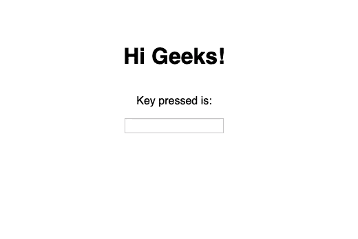

# 如何在 ReactJS 中使用 onKeyPress 事件？

> 原文:[https://www . geeksforgeeks . org/how-用法-on key press-event-in-reactjs/](https://www.geeksforgeeks.org/how-to-use-onkeypress-event-in-reactjs/)

ReactJS 中的 onKeyPress 事件发生在用户按下键盘上的某个键时，但并不是所有的键都触发该事件，例如所有浏览器中的 ALT、CTRL、SHIFT、ESC。

为了在 ReactJS 中使用 onKeyPress 事件，我们将使用预定义的 onKeyPress 方法。

**创建反应应用程序:**

**步骤 1:** 使用以下命令创建一个反应应用程序:

```jsx
npx create-react-app functiondemo
```

**步骤 2:** 创建项目文件夹(即 functiondemo)后，使用以下命令移动到该文件夹:

```jsx
cd functiondemo
```

**项目结构:**如下图。


项目结构

**示例:**在本例中，我们将构建一个显示输入框中按下的键的应用程序。

**Filename- App.js:** 现在在 App.js 文件中写下以下代码。在这里，App 是我们编写代码的默认组件。

## java 描述语言

```jsx
import React, { useState } from 'react';

const App = () => {
  const [state, setState] = useState('');

  const handler = (event) => {
      // changing the state to the name of the key
    // which is pressed
    setState(event.key);
  };

  return (
    <div>
      <h1>Hi Geeks!</h1>

<p>Key pressed is: {state}</p>

      {/* Passing the key pressed to the handler function */}
      <input type="text" onKeyPress={(e) => handler(e)} />

    </div>
  );
};

export default App;
```

**注意:**可以在 App.css 文件中定义自己的样式。

**运行应用程序的步骤:**从项目的根目录使用以下命令运行应用程序:

```jsx
npm start
```

**输出:**

