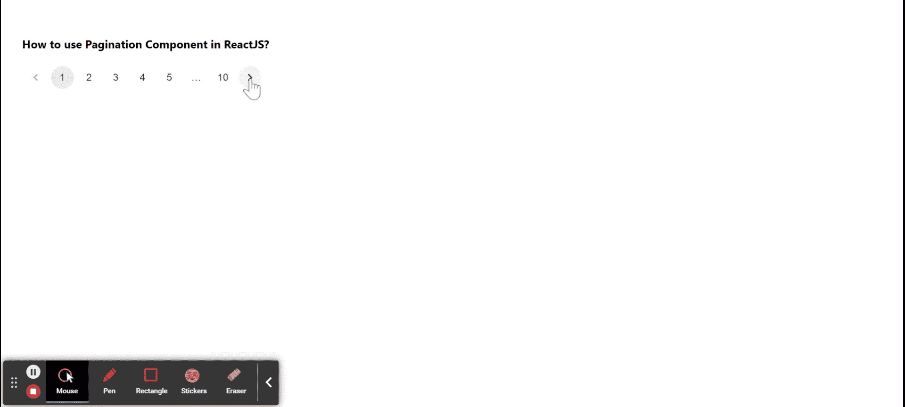

# 如何在 ReactJS 中使用分页组件？

> 原文:[https://www . geeksforgeeks . org/如何使用-分页-组件 in-reactjs/](https://www.geeksforgeeks.org/how-to-use-pagination-component-in-reactjs/)

分页是一项功能，用户可以通过它在网站或应用程序的页面之间轻松切换。在该组件的帮助下，用户可以从一系列页面中选择特定的页面。【React 的 Material UI 有这个组件可供我们使用，非常容易集成。我们可以在 ReactJS 中使用以下方法来使用分页组件。

**创建反应应用程序并安装模块:**

*   **步骤 1:** 使用以下命令创建一个反应应用程序:

    ```
    npx create-react-app foldername
    ```

*   **步骤 2:** 在创建项目文件夹(即文件夹名**)后，使用以下命令将**移动到该文件夹:

    ```
    cd foldername
    ```

*   **步骤 3:** 创建 ReactJS 应用程序后，使用以下命令安装 **material-ui** 模块:

    ```
    npm install @material-ui/lab
    ```

**项目结构:**如下图。


项目结构

**示例:**现在在 **App.js** 文件中写下以下代码。在这里，App 是我们编写代码的默认组件。

## App.js

```
import React from 'react';
import Pagination from '@material-ui/lab/Pagination';

export default function App() {
  return (
    <div style={{ display: 'block', padding: 30 }}>
      <h4>How to use Pagination Component in ReactJS?</h4>
      <Pagination count={10} />
    </div>
  );
}
```

**运行应用程序的步骤:**从项目的根目录使用以下命令运行应用程序:

```
npm start
```

**输出:**现在打开浏览器，转到***http://localhost:3000/***，会看到如下输出:



**参考:**T2】https://material-ui.com/components/pagination/