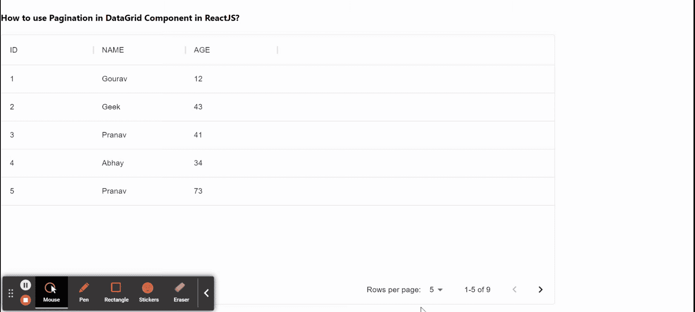

# 如何在 ReactJS 中使用 DataGrid 组件中的分页？

> 原文:[https://www . geeksforgeeks . org/如何使用-datagrid 中的分页-component-in-reactjs/](https://www.geeksforgeeks.org/how-to-use-pagination-in-datagrid-component-in-reactjs/)

[分页](https://www.geeksforgeeks.org/how-to-show-pagination-in-reactjs/)有助于查看来自指定数据源的数据段。分页改善了用户体验，因为用户可以在页面之间切换以查看数据。数据网格组件有助于以类似网格的行和列格式显示信息。我们可以在 ReactJS 中使用以下方法来使用数据网格组件中的分页。

**方法:**按照这些简单的步骤在 ReactJS 中使用数据网格组件中的分页。在下面的例子中，借助 ***行页面选项*** 道具，我们可以在数据网格组件中进行分页，就像我们将[2，5，7]作为一个值传递一样，这意味着我们可以向用户显示在单个页面上查看 2 行、5 行或 7 行的选项。默认的页面大小是 100，但是我们可以用页面大小来改变这个值。

**创建反应应用程序并安装模块:**

*   **步骤 1:** 使用以下命令创建一个反应应用程序:

    ```jsx
    npx create-react-app foldername
    ```

*   **步骤 2:** 创建项目文件夹(即文件夹名**)后，使用以下命令移动到该文件夹中:**

    ```jsx
    cd foldername
    ```

*   **步骤 3:** 创建 ReactJS 应用程序后，使用以下命令安装 **material-ui** 模块:

    ```jsx
    npm install @material-ui/data-grid
    ```

**项目结构:**如下图。


项目结构

**示例:**现在在 **App.js** 文件中写下以下代码。在这里，App 是我们编写代码的默认组件。

## App.js

```jsx
import * as React from 'react';
import { DataGrid } from '@material-ui/data-grid';

const columns = [
  { field: 'id', headerName: 'ID', width: 170 },
  { field: 'name', headerName: 'NAME', width: 170 },
  { field: 'age', headerName: 'AGE', width: 170 },
];

const rows = [
  { id: 1, name: 'Gourav', age: 12 },
  { id: 2, name: 'Geek', age: 43 },
  { id: 3, name: 'Pranav', age: 41 },
  { id: 4, name: 'Abhay', age: 34 },
  { id: 5, name: 'Pranav', age: 73 },
  { id: 6, name: 'Disha', age: 61 },
  { id: 7, name: 'Raghav', age: 72 },
  { id: 8, name: 'Amit', age: 24 },
  { id: 9, name: 'Anuj', age: 48 },
];

export default function App() {

  return (
    <div style={{ height: 500, width: '80%' }}>
      <h4>
        How to use Pagination in DataGrid
        Component in ReactJS?
      </h4>
      <DataGrid rows={rows} columns={columns} 
        pageSize={5} rowsPerPageOptions={[2, 5, 7]}
      />
    </div>
  );
}
```

**运行应用程序的步骤:**从项目的根目录使用以下命令运行应用程序:

```jsx
npm start
```

**输出:**现在打开浏览器，转到***http://localhost:3000/***，会看到如下输出:



**参考:**T2】https://material-ui.com/components/data-grid/pagination/