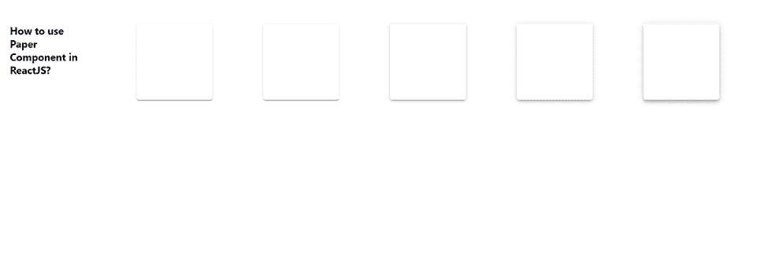

# 如何在 ReactJS 中使用纸张组件？

> 原文:[https://www . geeksforgeeks . org/how-to-use-paper-in-component-reactjs/](https://www.geeksforgeeks.org/how-to-use-paper-component-in-reactjs/)

在材料设计中，纸张的物理特性被转换到屏幕上。React 的 Material UI 有这个组件可供我们使用，非常容易集成。我们可以使用以下方法在 ReactJS 中使用纸张组件。

**创建反应应用程序并安装模块:**

**步骤 1:** 使用以下命令创建一个反应应用程序:

```jsx
npx create-react-app foldername
```

**步骤 2:** 创建项目文件夹(即文件夹名**)后，使用以下命令移动到该文件夹中:**

```jsx
cd foldername
```

**步骤 3:** 创建 ReactJS 应用程序后，使用以下命令安装 **material-ui** 模块:

```jsx
npm install @material-ui/core
```

**App.js:** 现在在 **App.js** 文件中写下以下代码。在这里，App 是我们编写代码的默认组件。

## java 描述语言

```jsx
import React from "react";
import Paper from "@material-ui/core/Paper";
import { makeStyles } from "@material-ui/core/styles";

export default function App() {
  const useStyles = makeStyles((theme) => ({
    mainClass: {
      flexWrap: "wrap",
      display: "flex",
      "& > *": {
        height: theme.spacing(15),
        margin: theme.spacing(5),
        width: theme.spacing(15),
      },
    },
  }));

  const classes = useStyles();

  return (
    <div className={classes.mainClass}>
      <h4>How to use Paper Component in ReactJS?</h4>
      <Paper />
      <Paper elevation={1} />
      <Paper elevation={2} />
      <Paper elevation={3} />
      <Paper elevation={4} />
    </div>
  );
}
```

**运行应用程序的步骤:**从项目的根目录使用以下命令运行应用程序。

```jsx
npm start
```

**输出:**现在打开浏览器，转到***http://localhost:3000/***，会看到如下输出。

