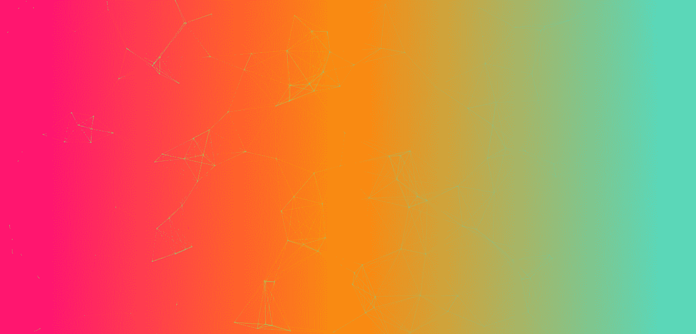
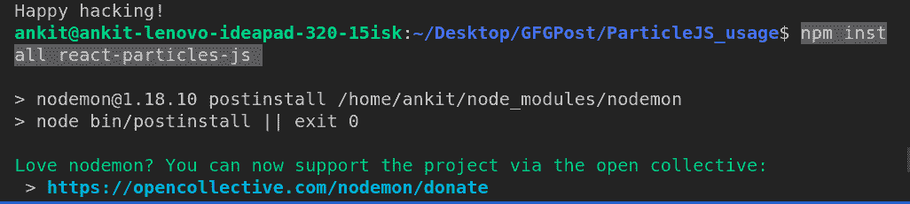
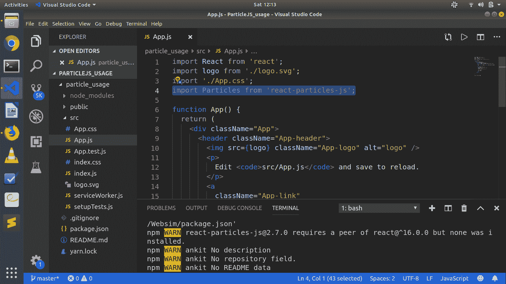
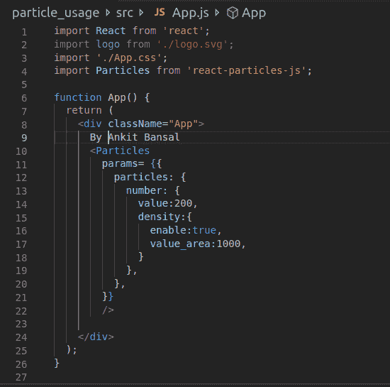
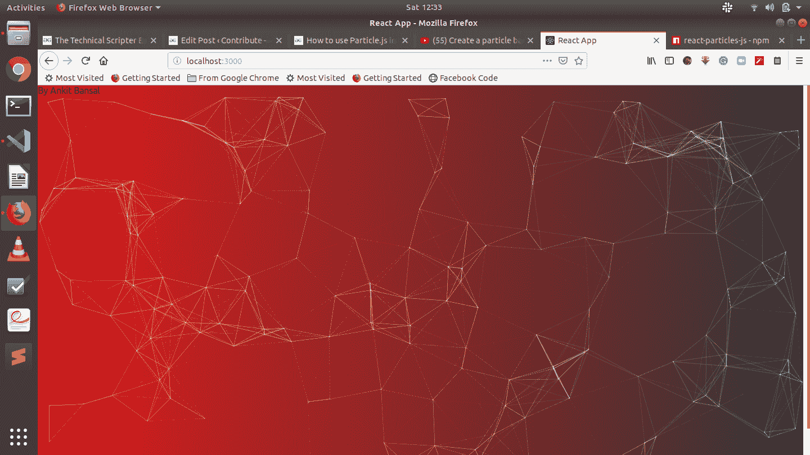

# 如何在 React 项目中使用粒子. js？

> 原文:[https://www . geesforgeks . org/如何使用-粒子-js-in-react-project/](https://www.geeksforgeeks.org/how-to-use-particles-js-in-react-project/)

**Particles.js** 是一个无依赖、轻量级、响应灵敏的 JavaScript 插件，用于类似设计这样的灵活且反应灵敏的粒子。



我们可以在我们的反应项目中使用[反应粒子](https://www.npmjs.com/package/react-particles-js)来添加粒子。把这个加入到你的 react 项目中，肯定会吸引更多的观众。

**1。安装过程:**在终端运行以下命令安装粒子

*   对于 npm:

    ```jsx
    npm install react-particles-js
    ```

*   对于纱线:

    ```jsx
    yarn add react-particles-js
    ```



**2。导入包:**导入文件中的包。要导入包，请粘贴以下代码:

```jsx
import Particles from 'react-particles-js';
```



**3。渲染:**在组件渲染功能的返回中添加元素<粒子/ >。一些重要的道具有:

*   宽度:画布的宽度。
*   高度:画布的高度。
*   参数:要传递的参数。

**示例:**

```jsx
// Complete React Code
import React from 'react';
import './App.css';
import Particles from 'react-particles-js';

function App() {
  return (
    <div className="App">
      By Ankit Bansal
      <Particles
        params={{
          particles: {
            number: {
              value: 200,
              density: {
                enable: true,
                value_area: 1000,
              }
            },
          },
        }}
      />

    </div>
  );
}

export default App;
```



**4。启动**使用`npm start`命令启动 npm，你会得到一个非常吸引人的背景。



**注意:**添加<粒子/ >元素作为返回 div 的最后一个元素。