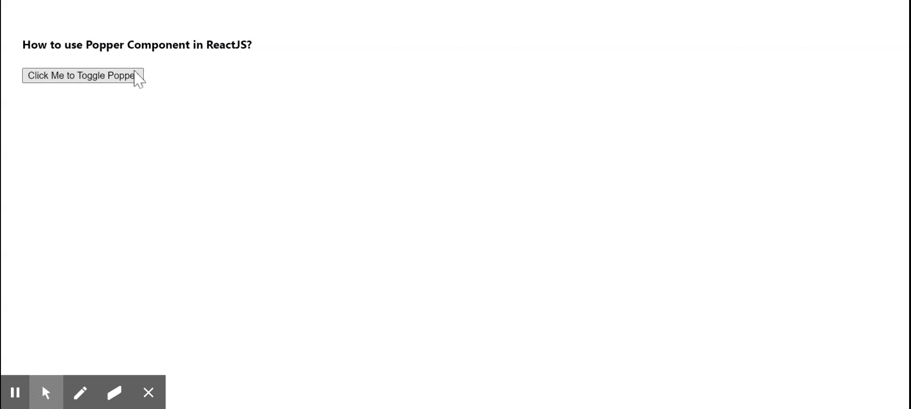

# 如何在 ReactJS 中使用 Popper 组件？

> 原文:[https://www . geeksforgeeks . org/how-用法-popper-in-component-reactjs/](https://www.geeksforgeeks.org/how-to-use-popper-component-in-reactjs/)

一个 **Popper** 用于将内容的一部分显示在另一部分之上。这是 react-popper 的另一个特性。React 的 Material UI 有这个组件可供我们使用，而且它很简单，非常容易集成。为了完美定位，它使用了第三方库 Popper.js。

**创建反应应用程序并安装模块:**

**步骤 1:** 使用以下命令创建一个 React 应用程序。

```jsx
npx create-react-app foldername
```

**步骤 2:** 在创建项目文件夹(即文件夹名**)后，使用以下命令移动到该文件夹。**

```jsx
cd foldername
```

**步骤 3:** 创建 ReactJS 应用程序后，使用以下命令安装 **material-ui** 模块。

```jsx
npm install @material-ui/core
```

**项目结构:**


项目结构

**示例:**现在在 **App.js** 文件中写下以下代码。在这里，App 是我们编写代码的默认组件。

## App.js

```jsx
import React from 'react';
import Popper from '@material-ui/core/Popper';

export default function App() {

  const [anchorEl, setAnchorEl] = React.useState(null);
  const open = Boolean(anchorEl);

  return (
    <div style={{ display: 'block', padding: 30 }}>
      <h4>How to use Popper Component in ReactJS?</h4>
      <button type="button" onClick={(event) => {
        setAnchorEl(anchorEl ? null : event.currentTarget);
      }}>
        Click Me to Toggle Popper
      </button>
      <Popper
        id={open ? 'simple-popper' : undefined}
        open={open}
        anchorEl={anchorEl}>
        <div style={{
          padding: 2,
          border: '1px solid',
          backgroundColor: 'gray',
        }}>Greetings from GeeksforGeeks</div>
      </Popper>
    </div>
  );
}
```

**运行应用程序的步骤:**从项目的根目录使用以下命令运行应用程序。

```jsx
npm start
```

**输出:**现在打开浏览器，转到***http://localhost:3000/***，会看到如下输出。



**参考:**T2】https://material-ui.com/components/popper/