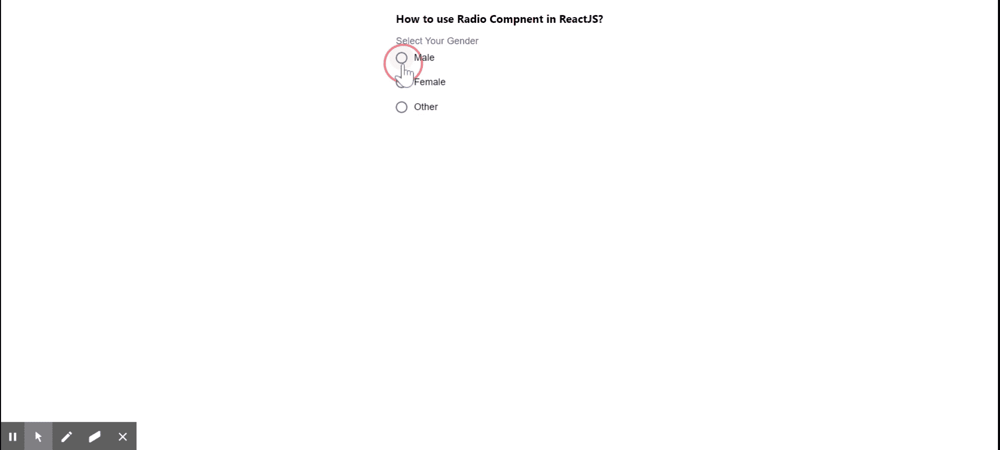

# 如何在 ReactJS 中使用无线电组件？

> 原文:[https://www . geeksforgeeks . org/如何使用无线电组件 in-reactjs/](https://www.geeksforgeeks.org/how-to-use-radio-component-in-reactjs/)

**单选按钮**允许用户从一组选项中选择一个。React 的 Material UI 有这个组件可供我们使用，非常容易集成。我们可以使用以下方法在 ReactJS 中使用无线电组件:

**创建反应应用程序并安装模块:**

**步骤 1:** 使用以下命令创建一个反应应用程序:

```jsx
npx create-react-app foldername
```

**步骤 2:** 创建项目文件夹(即文件夹名**)后，使用以下命令移动到该文件夹中:**

```jsx
cd foldername
```

**步骤 3:** 创建 ReactJS 应用程序后，使用以下命令安装 **material-ui** 模块:

```jsx
npm install @material-ui/core
```

**项目结构:**如下图。


项目结构

**App.js:** 现在在 **App.js** 文件中写下以下代码。在这里，App 是我们编写代码的默认组件。

## java 描述语言

```jsx
import React from 'react';
import Radio from '@material-ui/core/Radio';
import FormControl from '@material-ui/core/FormControl';
import FormLabel from '@material-ui/core/FormLabel';
import FormControlLabel from '@material-ui/core/FormControlLabel';
import RadioGroup from '@material-ui/core/RadioGroup';

const App = () => {

  return (
    <div style={{
      margin: 'auto',
      display: 'block',
      width: 'fit-content'
    }}>
      <h3>How to use Radio Component in ReactJS?</h3>
      <FormControl component="fieldset">
      <FormLabel component="legend">Select Your Gender</FormLabel>
      <RadioGroup aria-label="gender" name="gender1">
        <FormControlLabel value="male" control={<Radio />} label="Male" />
        <FormControlLabel value="female" control={<Radio />} label="Female" />
        <FormControlLabel value="other" control={<Radio />} label="Other" />
      </RadioGroup>
    </FormControl>
    </div>
  );
}

export default App;
```

**运行应用程序的步骤:**从项目的根目录使用以下命令运行应用程序:

```jsx
npm start
```

**输出:**现在打开浏览器，转到***http://localhost:3000/***，会看到如下输出:

