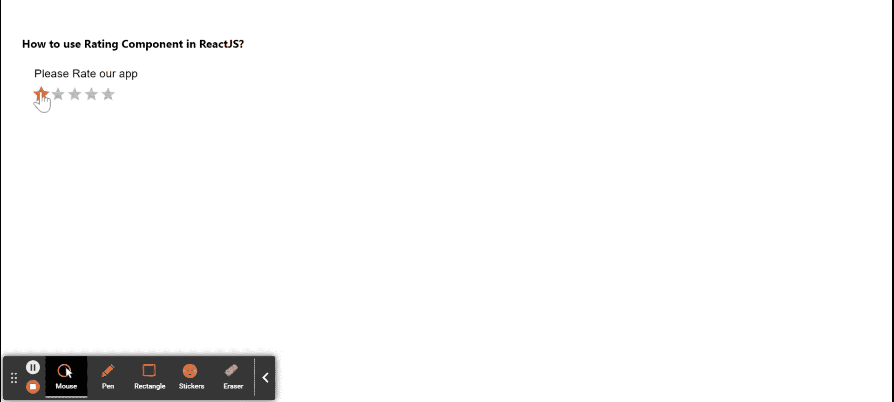

# 如何在 ReactJS 中使用评级组件？

> 原文:[https://www . geeksforgeeks . org/how-to-use-rating-component-in-reactjs/](https://www.geeksforgeeks.org/how-to-use-rating-component-in-reactjs/)

评级组件有助于以评级的形式获取用户反馈。借助这个功能，u sers 还可以对自己购买的产品进行评级。【React 的 Material UI 有这个组件可供我们使用，非常容易集成。我们可以在 ReactJS 中使用以下方法来使用评级组件。

**创建反应应用程序并安装模块:**

*   **步骤 1:** 使用以下命令创建一个反应应用程序:

    ```jsx
    npx create-react-app foldername
    ```

*   **步骤 2:** 在创建项目文件夹(即文件夹名**)后，使用以下命令将**移动到该文件夹:

    ```jsx
    cd foldername
    ```

*   **步骤 3:** 创建 ReactJS 应用程序后，使用以下命令安装 **material-ui** 模块:

    ```jsx
    npm install @material-ui/core
    npm install @material-ui/lab
    ```

**项目结构:**如下图。


项目结构

**示例:**现在在 **App.js** 文件中写下以下代码。在这里，App 是我们编写代码的默认组件。

## App.js

```jsx
import React from 'react';
import Rating from '@material-ui/lab/Rating';
import Typography from '@material-ui/core/Typography';
import Box from '@material-ui/core/Box';

export default function App() {

  const [ratingValue, setRatingValue] = React.useState(0);

  return (
    <div style={{ display: 'block', padding: 30 }}>
      <h4>How to use Rating Component in ReactJS?</h4>
      <Box component="fieldset" mb={3} borderColor="transparent">
        <Typography component="legend">
            Please Rate our app
        </Typography>
        <Rating
          name="Rating Label"
          value={ratingValue}
          onChange={(event, newValue) => {
            setRatingValue(newValue);
          }}
        />
      </Box>
    </div>
  );
}
```

**运行应用程序的步骤:**从项目的根目录使用以下命令运行应用程序:

```jsx
npm start
```

**输出:**现在打开浏览器，转到***http://localhost:3000/***，会看到如下输出:



**参考:**T2】https://material-ui.com/components/rating/