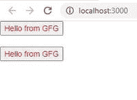

# 如何使用 React.cloneElement()函数？

> 原文:[https://www . geesforgeks . org/how-use-react-clone element-function/](https://www.geeksforgeeks.org/how-to-use-react-cloneelement-function/)

当父组件想要添加或修改其子组件的道具时，我们可以使用 React.cloneElement()方法。React.cloneElement()函数创建给定元素的克隆，我们还可以在函数中传递道具和子元素。

最终的元素将初始元素的道具与新道具混合在一起。现有的子代将被新的子代替换。原始元素的键和引用将被保留。

**语法:**

```jsx
React.cloneElement(
 element,
 [props],
 [...children]
)
```

第一个参数是我们想要克隆的元素。第二个参数将是我们想要与元素一起添加的附加道具。第三个参数是克隆元素的子元素，现有元素的子元素不会被复制到克隆元素中。

使用 React.cloneElement()克隆元素几乎与以下操作相同:

```jsx
<element.type {...element.props} {...new_props}>
   {new_children}
</element.type>
```

然而，它也保留了参考文献。这意味着如果你有一个孩子，你不会无意中从你的祖先那里偷一个引用。相同的引用将被分配给您的新元素。

**创建反应应用程序:**

*   **步骤 1:** 使用以下命令创建一个反应应用程序:

    ```jsx
    npx create-react-app foldername
    ```

*   **步骤 2:** 创建项目文件夹(即文件夹名)后，使用以下命令移动到该文件夹:

    ```jsx
    cd foldername
    ```

**项目结构:**如下图。


**App.js:** 现在在 **App.js** 文件中写下以下代码。在这里，App 是我们编写代码的默认组件。

## App.js

```jsx
import React from 'react';
class App extends React.Component {
  render() {
    return (
      <Parent>
        <Button />
        <br /><br />
        <Button />
      </Parent>
    )
  }
}

class Parent extends React.Component {
  render() {
    let btncolor = 'red';
    return (
      <div>
        {React.Children.map(this.props.children,
          child => {
            return React.cloneElement(child,
              { btncolor }, null); //third parameter is null
              // Because we are not adding any children
          })}
      </div>
    )
  }
}

class Button extends React.Component {
  render() {
    return (
      <button style=
        {{ color: this.props.btncolor }}>
        Hello from GFG
      </button>
    )
  }
}

export default App
```

**运行应用程序的步骤:**从项目的根目录使用以下命令运行应用程序:

```jsx
npm start
```

**输出:**现在打开浏览器，转到***http://localhost:3000/***，会看到如下输出:



**解释:**从上面的代码中我们可以看到，Parent 组件正在使用 React.cloneElement()方法给子(Button)组件添加文本颜色的新道具。