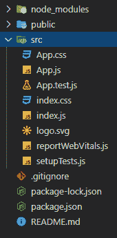
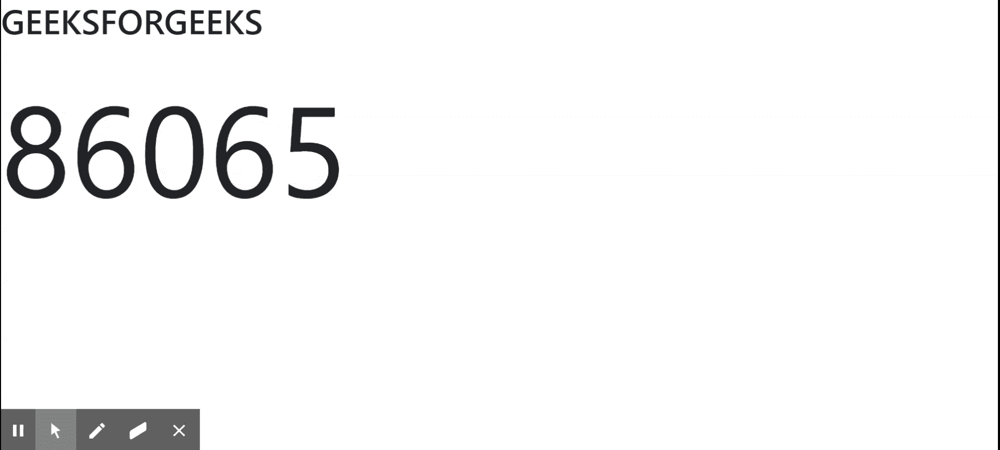

# 如何在 ReactJS 中使用 react-countup 模块？

> 原文:[https://www . geeksforgeeks . org/how-use-react-count up-module-in-react js/](https://www.geeksforgeeks.org/how-to-use-react-countup-module-in-reactjs/)

在我们的反应应用程序中，有时我们希望一个数字以从零到初始值的递增方式显示，在这种情况下**反应-计数**开始起作用。这是一个 npm 包，我们需要安装使用计数功能。

**创建反应应用程序并安装模块:**

**步骤 1:** 使用以下命令创建一个反应应用程序:

```jsx
npx create-react-app foldername
```

**步骤 2:** 创建项目文件夹(即文件夹名**)后，使用以下命令移动到该文件夹中:**

```jsx
cd foldername
```

**步骤 3:** 创建 ReactJS 应用程序后，使用以下命令安装**react-count**模块:

```jsx
npm install react-countup
```

**项目结构:**


**示例:**现在在 **App.js** 文件中写下以下代码。在这里，App 是我们编写代码的默认组件。

## App.js

```jsx
import React from 'react';
import CountUp from 'react-countup';

function App() {
  return (
    <div className="App">
      <h1>GEEKSFORGEEKS</h1>
      <div style={{fontSize:'150px' }}>
        <CountUp
          start={0}
          end={100000}
          duration={3}
        />    
      </div>
    </div>
  );
}

export default App;
```

**运行应用程序的步骤:**从项目的根目录使用以下命令运行应用程序:

```jsx
npm start
```

**输出:**现在打开浏览器，转到***http://localhost:3000/***，会看到如下输出:

