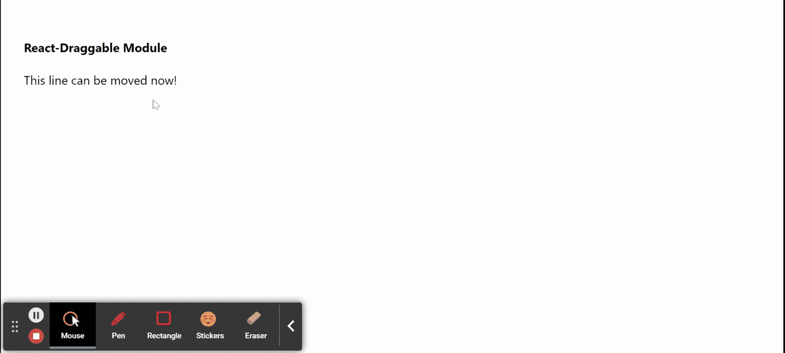

# 如何在 ReactJS 中使用 react-draggable 模块？

> 原文:[https://www . geeksforgeeks . org/how-use-react-draggable-module-in-react js/](https://www.geeksforgeeks.org/how-to-use-react-draggable-module-in-reactjs/)

我们可以在 ReactJS 中使用*****react-draggable***模块进行元素的制作可拖动。在 CSS 变换的帮助下，可拖动的项目在内部移动。该模块允许项目变得可拖动，而不管它们的当前位置。我们可以在 ReactJS 中使用以下方法来使用*反应可拖动*模块。**

****方法:**在下面的例子中，我们使用了*反应可拖动*模块来演示如何在我们的 ReactJS 应用程序中使用它。我们已经从库中导入了可拖动组件，并在我们的主应用程序组件中使用了它，现在无论这个可拖动组件中有什么内容，都可以用鼠标在屏幕上拖动。就像你下面的例子，我们有一个 div，文本 ***这条线现在可以移动了！*** 可拖动，如下图所附 gif。**

****可拖动道具:****

*   ****允许点击:**如果该值设置为真，则允许非左键点击拖动。**
*   ****轴:**用于确定可拖动物体可以在哪个轴上移动。**
*   ****边界:**用于表示运动边界。**
*   ****取消:**用于表示选择器，可用于防止拖动初始化。**
*   ****默认类名:**用于表示可拖动界面的类名。**
*   ****默认类名拖动:**用于表示拖动运动的默认类名。**
*   ****默认类名拖动:**用于表示拖动运动的默认类名。**
*   ****默认位置:**用于表示拖动应该开始的默认 x、y 坐标。**
*   ****禁用:**用于禁用组件。**
*   ****网格:**用于表示拖动应捕捉到的 x 和 y 坐标。**
*   ****手柄:**用于表示选择器，用作启动拖动的手柄。**
*   ****offsetParent:** 用来传递我们自己的 offsetParent 进行阻力计算。**
*   ****onMouseDown:** 是用户鼠标下移事件触发的回调函数。**
*   ****onStart:** 是拖动开始时触发的回调函数。**
*   ****onDrag:** 是拖动时触发的回调函数。**
*   ****onStop:** 是拖动停止时触发的回调函数。**
*   ****nodeRef:** 用于将 nodeRef 元素传递给底层组件。**
*   ****位置:**当用户想要直接控制元素时使用。它使物品*受到控制*。**
*   ****位置偏移:**用于表示开始时的位置偏移。**
*   ****比例:**用于表示进行拖动的画布的比例。**

****创建反应应用程序并安装模块:****

*   ****步骤 1:** 使用以下命令创建一个反应应用程序:**

     **```
    npx create-react-app foldername
    ```** 
*   ****步骤 2:** 在创建项目文件夹(即文件夹名**)后，使用以下命令将**移动到该文件夹:**

    ```
    cd foldername
    ```

*   ****步骤 3:** 创建 ReactJS 应用程序后，使用以下命令安装所需的****模块:******

    ```
    ****npm install react-draggable****
    ```

********项目结构:**如下图。******

****

项目结构**** 

******示例:**现在在 **App.js** 文件中写下以下代码。在这里，App 是我们编写代码的默认组件。****

## ****App.js****

```
**import React from 'react';
import Draggable from 'react-draggable';

export default function App() {
  return (
    <div style={{ display: 'block', width: 700, padding: 30 }}>
      <h4>React-Draggable Module</h4>
      <div style={{ width: 660, height: 'auto' }}>
        <Draggable>
          <div>This line can be moved now!</div>
        </Draggable>
      </div>
    </div>
  );
}**
```

******运行应用程序的步骤:**从项目的根目录使用以下命令运行应用程序:****

```
**npm start**
```

******输出:**现在打开浏览器，转到***http://localhost:3000/***，会看到如下输出:****

********

******参考:**T2】https://www.npmjs.com/package/react-draggable****