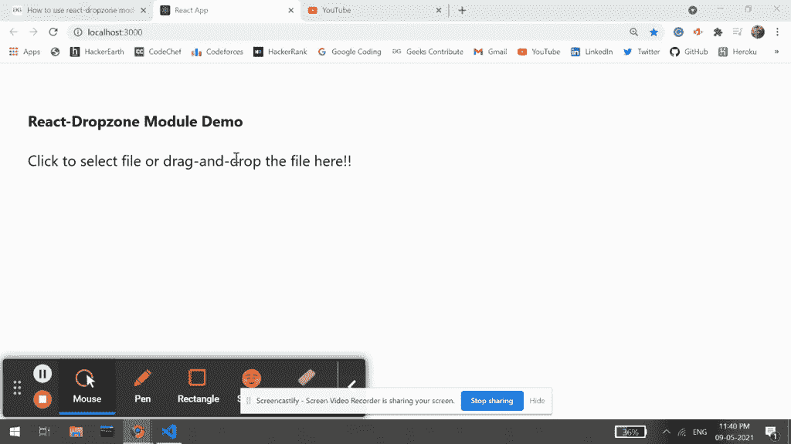

# 如何在 ReactJS 中使用 react-dropzone 模块？

> 原文:[https://www . geesforgeks . org/如何使用-反应-drop zone-module-in-reactjs/](https://www.geeksforgeeks.org/how-to-use-react-dropzone-module-in-reactjs/)

反应-拖放区模块是一个 si 简单的反应挂钩用于为 n 个文件创建一个符合html 5 的拖放区。我们可以利用这个模块为用户提供一种方式，让拖放他们的多个文件，然后我们可以根据业务需求来处理这些文件。  我们可以在 ReactJS 中使用以下方法来使用 *react-dropzone* 模块。

**方法:**在以下示例中，我们使用了 *react-dropzone* 模块来演示如何在我们的 ReactJS 应用程序中使用它。我们已经从模块中导入了*usedrozone*，这是一个包装组件，用来获取 dropzone 属性获取器，我们已经使用这些属性获取器在我们的 Input 元素上创建了拖放区。现在每当用户点击我们的示例文本: *点击选择文件或将文件拖放到这里！！*，它将允许用户选择文件，然后我们可以根据业务需求对该文件执行任何操作。

**拖放区道具获取器:**它有助于创建一个拖放区，因为这些是获取器函数，返回带有属性的对象，这些属性是用于创建拖放区的。输入属性应该应用于<输入>元素，而根属性可以应用于任何元素。

**参考文献:**我们从 *Dropzone* 道具获得的*getrootpols*和 *getInputProps* 功能接受自定义*参考文献*作为参数属性之一。当我们试图应用于一个元素的*getrootpolps*和 *getInputProps* e 函数中的道具没有公开对该元素的引用时，这是很有用的。

**创建反应应用程序并安装模块:**

*   **步骤 1:** 使用以下命令创建一个反应应用程序:

    ```
    npx create-react-app foldername
    ```

*   **步骤 2:** 创建项目文件夹(即文件夹名**)后，使用以下命令移动到该文件夹中:**

    ```
    cd foldername
    ```

*   **步骤 3:** 创建 ReactJS 应用程序后，使用以下命令安装所需的****模块:****

    ```
    **npm install react-dropzone** 
    ```

******项目结构:**如下图。****

****

项目结构**** 

******示例:**现在在 **App.js** 文件中写下以下代码。在这里，App 是我们编写代码的默认组件。****

## ****App.js****

```
**import React, { useCallback } from 'react'
import { useDropzone } from 'react-dropzone'

export default function App() {

  const onDrop = useCallback(acceptedFiles => {
    alert(acceptedFiles[0].name)
    console.log("Now you can do anything with"+
                " this file as per your requirement")
  }, [])

  const { getInputProps, getRootProps } = useDropzone({ onDrop })

  return (
    <div style={{ display: 'block', width: 700, padding: 30 }}>
      <h4>React-Dropzone Module Demo</h4>
      <div {...getRootProps()}>
        <input {...getInputProps()} />
        <p>Click to select file or 
           drag-and-drop the file here!!</p>

      </div>
    </div>
  );
}**
```

******运行应用程序的步骤:**从项目的根目录使用以下命令运行应用程序:****

```
**npm start**
```

******输出:**现在打开浏览器，转到***http://localhost:3000/***，会看到如下输出:****

********

******参考:**T2】https://www.npmjs.com/package/react-dropzone****