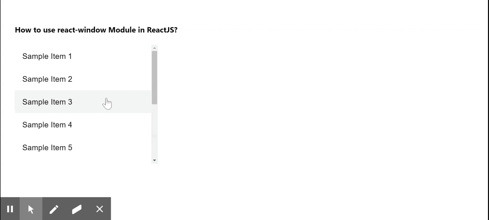

# 如何在 ReactJS 中使用反应窗口模块？

> 原文:[https://www . geeksforgeeks . org/如何使用-反应-窗口-模块-in-reactjs/](https://www.geeksforgeeks.org/how-to-use-react-window-module-in-reactjs/)

React window 仅通过渲染大数据集 的部分来工作。这个模块非常容易集成，减少了一般渲染需要的时间。该模块避免了对 DOM 节点的过度分配。我们可以使用以下方法在 ReactJS 中使用**反应窗口**模块。

**创建反应应用程序并安装模块:**

**步骤 1:** 使用以下命令创建一个 React 应用程序。

```jsx
npx create-react-app foldername
```

**步骤 2:** 在创建项目文件夹(即文件夹名**)后，使用以下命令移动到该文件夹。**

```jsx
cd foldername
```

**步骤 3:** 创建 ReactJS 应用程序后，使用以下命令安装**材料界面**和**反应窗口**模块。

```jsx
npm install @material-ui/core
npm install react-window
```

**项目结构:**如下图。


项目结构

**示例:**现在在 **App.js** 文件中写下以下代码。在这里，App 是我们编写代码的默认组件。

## App.js

```jsx
import React from "react";
import ListItem from "@material-ui/core/ListItem";
import ListItemText from "@material-ui/core/ListItemText";
import { FixedSizeList } from "react-window";

function renderOurRow(props) {
  const { index } = props;

  return (
    <ListItem key={index} button>
      <ListItemText primary={`Sample Item ${index + 1}`} />
    </ListItem>
  );
}

export default function App() {
  return (
    <div style={{ display: "block", padding: 30 }}>
      <h4>How to use react-window Module in ReactJS?</h4>
      <FixedSizeList height={250} 
                     width={300} 
                     itemSize={100} 
                     itemCount={5}>
        {renderOurRow}
      </FixedSizeList>
    </div>
  );
}
```

**运行应用程序的步骤:**从项目的根目录使用以下命令运行应用程序。

```jsx
npm start
```

**输出:**现在打开浏览器，转到***http://localhost:3000/***，会看到如下输出。



**参考:**T2】https://material-ui.com/components/lists/#virtualized-list