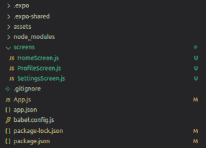

# 如何在 React Native 中使用带 React 导航的路由？

> 原文:[https://www . geesforgeks . org/how-to-use-routing-with-react-navigation-in-react-native/](https://www.geeksforgeeks.org/how-to-use-routing-with-react-navigation-in-react-native/)

几乎每个移动应用程序都需要在不同屏幕之间导航。React Native 提供了一个优雅且易于使用的库来为原生应用程序添加导航:react-navigation。它是在 React Native 应用程序中用于路由和导航的最流行的库之一。

多个屏幕之间的转换由导航器管理。反应导航允许各种导航器，如堆栈导航器、抽屉导航器、标签导航器等。除了在多个屏幕之间导航之外，它还可以用于在屏幕之间共享数据。

**进场:**我们将使用反应导航提供的 StackNavigator。它用于允许屏幕之间的转换，其中每个新屏幕都放置在堆栈的顶部。在我们的例子中，我们将创建 3 个屏幕，并使用 StackNavigator 在它们之间转换。我们还将学习如何将数据从一个屏幕传递到另一个屏幕，并与基本转换一起显示在屏幕标题中。

**创建应用和安装模块:**

*   **步骤 1:** 打开终端，通过以下命令安装 expo-cli。

    ```jsx
    npm install -g expo-cli
    ```

*   **步骤 2:** 现在通过以下命令创建一个项目。

    ```jsx
    expo init react-navigation-routing
    ```

*   **第三步:**现在进入你的项目文件夹，即反应-导航-路线

    ```jsx
    cd react-navigation-routing
    ```

*   **步骤 4:** 使用以下命令安装所需的软件包:

    > npm 安装-保存反应-导航反应-导航-堆栈反应-原生-重新激活反应-原生-手势-处理程序反应-原生-屏幕反应-原生-矢量-图标

**项目结构:**项目目录应该如下所示:



**示例:**在本例中，我们将创建 3 个屏幕，即主屏幕、配置文件屏幕和设置屏幕。我们将使用堆栈导航器，并用一些基本的样式来配置它。我们还将从一个屏幕动态发送数据，并将其作为标题显示在另一个屏幕上(从主屏幕上的用户那里获取输入，将其传递到配置文件屏幕，并将其显示在配置文件屏幕的标题上。

该文件包含基本的导航器设置。我们将使用 react-navigation-stack 库提供的 createStackNavigator()方法来创建我们的堆栈导航器。使用默认导航选项向所有 3 个屏幕提供一些基本样式。

## App.js

```jsx
import React from "react";
import { createAppContainer } from "react-navigation";
import { createStackNavigator } from "react-navigation-stack";

import HomeScreen from "./screens/HomeScreen";
import ProfileScreen from "./screens/ProfileScreen";
import SettingsScreen from "./screens/SettingsScreen";

const AppNavigator = createStackNavigator(
  {
    Home: HomeScreen,
    Profile: ProfileScreen,
    Settings: SettingsScreen,
  },
  {
    defaultNavigationOptions: {
      headerStyle: {
        backgroundColor: "#006600",
      },
      headerTintColor: "#FFF",
    },
  }
);

const Navigator = createAppContainer(AppNavigator);

export default function App() {
  return (
    <Navigator>
      <HomeScreen />
    </Navigator>
  );
}
```

这是我们堆栈的第一个屏幕。在此屏幕中，我们将要求用户提供一个配置文件名称作为输入，我们将把它传递到“配置文件”屏幕。

## HomeScreen.js

```jsx
import React, { useState } from "react";
import { Text, View, TextInput, Button } from "react-native";
import { Ionicons } from "@expo/vector-icons";

const Home = (props) => {
  const [input, setInput] = useState("");
  return (
    <View style={{ flex: 1, alignItems: "center", justifyContent: "center" }}>
      <Text style={{ color: "#006600", fontSize: 40 }}>Home Screen!</Text>
      <Ionicons name="ios-home" size={80} color="#006600" />
      <TextInput
        placeholder="Enter your profile"
        value={input}
        onChangeText={(value) => setInput(value)}
      />
      <Button
        title="Go to Profile"
        color="#006600"
        onPress={() =>
          props.navigation.navigate("Profile", { username: input })
        }
      />
    </View>
  );
};

export default Home;
```

该屏幕将接收用户在主屏幕中使用导航数据对象给出的输入，并在其标题中显示。

## profiles screen . js

```jsx
import React from "react";
import { Text, View, Button } from "react-native";
import { Ionicons } from "@expo/vector-icons";

const Profile = (props) => {
  return (
    <View style={{ flex: 1, alignItems: "center", justifyContent: "center" }}>
      <Text style={{ color: "#006600", fontSize: 40 }}>Profile Screen!</Text>
      <Ionicons name="ios-person-circle-outline" size={80} color="#006600" />
      <Button
        title="Go to Settings"
        color="#006600"
        onPress={() => props.navigation.navigate("Settings")}
      />
    </View>
  );
};

Profile.navigationOptions = (navData) => {
  return {
    headerTitle: navData.navigation.getParam("username"),
  };
};

export default Profile;
```

这是一个简单的屏幕，带有返回主屏幕的按钮。

## 设置屏幕.js

```jsx
import React from "react";
import { Text, View, Button } from "react-native";
import { Ionicons } from "@expo/vector-icons";

const Settings = (props) => {
  return (
    <View style={{ flex: 1, alignItems: "center", justifyContent: "center" }}>
      <Text style={{ color: "#006600", fontSize: 40 }}>Settings Screen!</Text>
      <Ionicons name="ios-settings-outline" size={80} color="#006600" />
      <Button
        title="Go to Home"
        color="#006600"
        onPress={() => props.navigation.navigate("Home")}
      />
    </View>
  );
};

export default Settings;
```

**运行应用程序的步骤:**使用以下命令启动服务器。

```jsx
expo start
```

**输出:**


**参考:**T2】https://reactnative.dev/docs/navigation