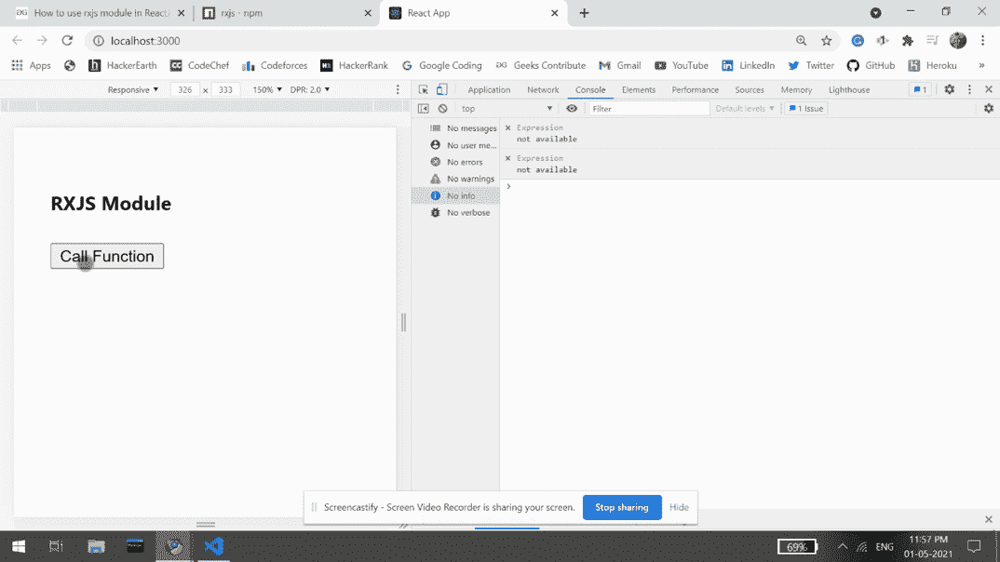

# 如何在 ReactJS 中使用 rxjs 模块？

> 原文:[https://www . geesforgeks . org/how-用法-rxjs-module-in-reactjs/](https://www.geeksforgeeks.org/how-to-use-rxjs-module-in-reactjs/)

Rxjs 代表 JavaScript 的反应式扩展。本模块 提供实现 oobservable类型 使用反应式编程即 异步编程范例。我们可以在 ReactJS 中使用以下方法来使用 *rxjs* 模块。

**方法:**在下面的示例中，我们使用了 Rxjs 模块来演示如何在我们的 ReactJS 应用程序中使用它。我们可以创建一个用户定义的*打印数据*函数，它有一个从 1 到 50 的范围函数，它过滤模 2 等于 1 的数字，并将其映射为自身相乘，然后我们在控制台屏幕上打印结果数字。我们在用户界面上有一个按钮，如果用户点击，这个*打印数据*功能被调用。

**创建反应应用程序并安装模块:**

*   **步骤 1:** 使用以下命令创建一个反应应用程序:

    ```jsx
    npx create-react-app foldername
    ```

*   **步骤 2:** 创建项目文件夹后，即文件夹名称**，**使用以下命令移动到项目文件夹:

    ```jsx
    cd foldername
    ```

*   **步骤 3:** 创建 ReactJS 应用程序后，使用以下命令安装所需的****模块:****

    ```jsx
    **npm install rxjs**
    ```

******项目结构:**如下图。****

****

项目结构**** 

******示例:**现在在 **App.js** 文件中写下以下代码。在这里，App 是我们编写代码的默认组件。****

## ****App.js****

```jsx
**import React from 'react';
import { range } from "rxjs";
import { map, filter } from "rxjs/operators";

const printData = () => {
  range(1, 50).pipe(filter(x => x % 2 === 1),
               map(x => x * x))
    .subscribe((item) => {
      console.log("Item: ", item)
    });
}

export default function App() {
  return (
    <div style={{ display: 'block', 
                  width: 700, padding: 30 }}>
      <h4>RXJS Module</h4>
      <div style={{ width: 660, height: 'auto' }}>
        <button onClick={printData}>
          Call Function
        </button>
      </div>
    </div>
  );
}**
```

******运行应用程序的步骤:**从项目的根目录使用以下命令运行应用程序:****

```jsx
**npm start**
```

******输出:**现在打开浏览器，转到***http://localhost:3000/***，会看到如下输出:****

********

******参考:**T2】https://www.npmjs.com/package/rxjs****