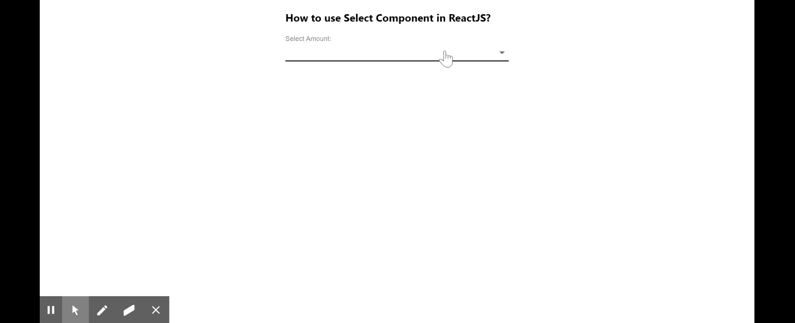

# 如何在 ReactJS 中使用选择组件？

> 原文:[https://www . geeksforgeeks . org/如何使用-选择组件-in-reactjs/](https://www.geeksforgeeks.org/how-to-use-select-component-in-reactjs/)

**从选项列表中选择**组件用于收集用户提供的信息。React 的 Material UI 有这个组件可供我们使用，非常容易集成。我们可以使用在 ReactJS 中选择组件，方法如下:

**创建反应应用程序并安装模块:**

**步骤 1:** 使用以下命令创建一个反应应用程序:

```
npx create-react-app foldername
```

**步骤 2:** 创建项目文件夹(即文件夹名**)后，使用以下命令移动到该文件夹中:**

```
cd foldername
```

**步骤 3:** 创建 ReactJS 应用程序后，使用以下命令安装 **material-ui** 模块:

```
npm install @material-ui/core
```

**项目结构:**如下图。


项目结构

**App.js:** 现在在 **App.js** 文件中写下以下代码。在这里，App 是我们编写代码的默认组件。

## java 描述语言

```
import React, { useState } from 'react';
import Select from '@material-ui/core/Select';
import InputLabel from '@material-ui/core/InputLabel';
import FormControl from '@material-ui/core/FormControl';
import MenuItem from '@material-ui/core/MenuItem';

const App = () => {

  const [currentValue, setCurrentValue] = useState(0)

  return (
    <div style={{
      margin: 'auto',
      display: 'block',
      width: 'fit-content'
    }}>
      <h3>How to use Select Component in ReactJS?</h3>
      <FormControl>
        <InputLabel id="demo-simple-select-label">
         Select Amount:
        </InputLabel>
        <Select
          labelId="demo-simple-select-label"
          value={currentValue}
          style={{
            width: 400,
          }}
          onClick={(e)=> {
            console.log("Current Value", currentValue)
            setCurrentValue(e.target.value)
          }}
        >
          <MenuItem value={1000}
          >1000</MenuItem>
          <MenuItem value={2000}
          >2000</MenuItem>
          <MenuItem value={3000}>3000</MenuItem>
        </Select>
      </FormControl>
    </div>
  );
}

export default App;
```

**运行应用程序的步骤:**从项目的根目录使用以下命令运行应用程序:

```
npm start
```

**输出:**现在打开浏览器，转到***http://localhost:3000/***，会看到如下输出:

