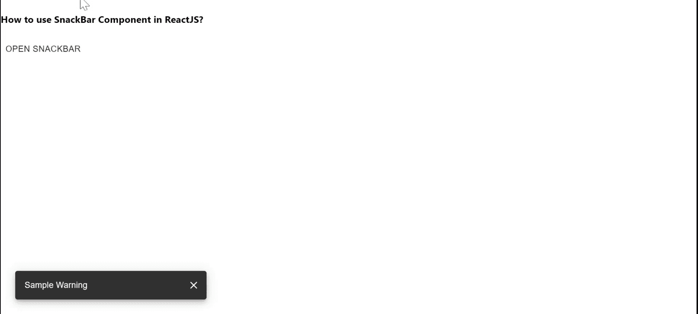

# 如何在 ReactJS 中使用 SnackBar 组件？

> 原文:[https://www . geesforgeks . org/how-用法-snackbar-component-in-reactjs/](https://www.geeksforgeeks.org/how-to-use-snackbar-component-in-reactjs/)

Snackbars 提供关于应用程序进程的简短消息。React 的 Material UI 有这个组件可供我们使用，非常容易集成。我们可以使用以下方法在 ReactJS 中使用 SnackBar 组件。

**创建反应应用程序并安装模块:**

**步骤 1:** 使用以下命令创建一个 React 应用程序。

```jsx
npx create-react-app foldername
```

**步骤 2:** 在创建项目文件夹(即文件夹名**)后，使用以下命令移动到该文件夹。**

```jsx
cd foldername
```

**步骤 3:** 创建 ReactJS 应用程序后，使用以下命令安装 **material-ui** 模块。

```jsx
npm install @material-ui/core
npm install @material-ui/icons
```

**项目结构:**如下图。


项目结构

**示例:**现在在 **App.js** 文件中写下以下代码。在这里，App 是我们编写代码的默认组件。

## App.js

```jsx
import React from "react";
import IconButton from "@material-ui/core/IconButton";
import Snackbar from "@material-ui/core/Snackbar";
import CloseIcon from "@material-ui/icons/Close";
import Button from "@material-ui/core/Button";

export default function App() {
  const [open, setOpen] = React.useState(false);

  const handleToClose = (event, reason) => {
    if ("clickaway" == reason) return;
    setOpen(false);
  };

  const handleClickEvent = () => {
    setOpen(true);
  };

  return (
    <div stlye={{}}>
      <h4>
        How to use SnackBar Component in ReactJS?
      </h4>
      <Button onClick={handleClickEvent}>
        Open Snackbar
      </Button>
      <Snackbar
        anchorOrigin={{
          horizontal: "left",
          vertical: "bottom",
        }}
        open={open}
        autoHideDuration={5000}
        message="Sample Warning"
        onClose={handleToClose}
        action={
          <React.Fragment>
            <IconButton
              size="small"
              aria-label="close"
              color="inherit"
              onClick={handleToClose}
            >
              <CloseIcon fontSize="small" />
            </IconButton>
          </React.Fragment>
        }
      />
    </div>
  );
}
```

**运行应用程序的步骤:**从项目的根目录使用以下命令运行应用程序。

```jsx
npm start
```

**输出:**现在打开浏览器，转到***http://localhost:3000/***，会看到如下输出。



**参考:**T2】https://material-ui.com/components/snackbars/