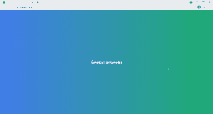

# 如何在 ReactJS 中使用样式？

> 原文:[https://www.geeksforgeeks.org/how-to-use-styles-in-reactjs/](https://www.geeksforgeeks.org/how-to-use-styles-in-reactjs/)

[React](https://www.geeksforgeeks.org/react-js-introduction-working/) 是一个 Javascript 前端库，用于构建单页应用程序(SPA)。React 应用程序可以通过将样式分配给类名道具来轻松设置样式。

有多种方式来设计 react app。在本文中，我们将讨论以下四种风格的反应应用程序。

1.  使用内嵌样式
2.  使用 CSS 文件
3.  使用 CSS 模块
4.  使用样式化组件

**项目设置–**我们可以使用下面命令行中提到的命令创建 React 应用程序。

```
npx create-react-app name_of_the_app
```

**注意:**跟随示例，请删除 App.js 和 App.css 文件的所有内容。

**使用内嵌样式的样式–**为了将内嵌样式应用于元素，我们使用样式道具。我们传递一个对象，该对象在 camelCase 中以键作为 CSS 属性，以值作为可以分配给这些 CSS 属性的值。

**语法:**将内联样式分配给 CSS 元素的语法如下。

```
<div style={{backgroundColor: 'red'}}></div>
```

**Filename:app . js**app . js 文件的内容在下面给出的代码中有所提及，其中我们为 React 元素添加了内联样式。

## App.js

```
const App = () => {
  return (
    <div
      style={{
        display: "flex",
        alignItems: "center",
        justifyContent: "center",
        height: "100vh",
        backgroundImage: 
          "linear-gradient(to right, #427ceb, #1dad6f)",
      }}
    >
      <h1 style={{ color: "white" }}>GeeksForGeeks</h1>
    </div>
  );
};

export default App;
```

**运行应用程序的步骤:**使用以下命令启动应用程序。

```
npm start
```

**输出:**打开浏览器，转到***http://localhost:3000***，会看到如下输出。



**注意:**对于下面给出的所有例子，输出将仅保持如上。虽然你可以通过粘贴 App.js 和 App.css 文件的内容并在你的设备上运行 React 应用来验证。

**使用 CSS 文件样式化–**要使用 CSS 文件样式化 React 元素，我们首先导入 CSS 文件，然后将 CSS 文件中包含的类分配给 React 元素的 className 属性。

**语法:**将类分配给类名道具的语法如下。

```
<div className="name_of_the_class"></div>
```

**文件名:app . js**app . js 和 App.css 文件的内容演示了如何使用 css 文件来设置 React 元素的样式，如下所述。

## App.js

```
import './App.css';

const App = () => {
  return (
    <div className='container-div'>
      <h1 className='heading'>GeeksForGeeks</h1>
    </div>
  );
};

export default App;
```

## App.css 文件

```
.container-div {
    display: flex;
    align-items: center;
    justify-content: center;
    height: 100vh;
    background-image: linear-gradient(
          to right, #427ceb, #1dad6f);
}

.heading {
    color: white;
}
```

**使用 CSS 模块进行样式化–**CSS 模块是一种在本地范围内定义 CSS 文件内容的方法。我们可以通过将我们的 CSS 文件命名为 App.modules.css 来创建一个 CSS 模块文件，然后可以使用下面提到的特殊语法将其导入 App.js 文件中。

**语法:**

```
import styles from './App.module.css';
```

现在，我们可以轻松地将类分配给下面提到的类名属性。

```
<div className={styles['container-div']}> 
    <h1 className={styles.heading}>GeeksForGeeks</h1>
</div>
```

方括号用于访问包含连字符的类，或者我们通常也可以使用它。当点不包含连字符时，可以用来访问类。

**文件名:app . js**app . js 和 App.css 文件的内容演示了如何使用 css 模块来设置 React 元素的样式，如下所述。

## App.js

```
import styles from './App.module.css';

const App = () => {
  return (
    <div className={styles['container-div']}>
      <h1 className={styles.heading}>GeeksForGeeks</h1> 
    </div>
  );
};

export default App;
```

## App.modules.css

```
.container-div {
    display: flex;
    align-items: center;
    justify-content: center;
    height: 100vh;
    background-image: linear-gradient(
          to right, #427ceb, #1dad6f);
}

.heading {
    color: white;
}
```

**使用 style-components 进行样式化–**style-components 是一个第三方包，它帮助我们基于向其提供的 React 元素和 CSS 样式创建一个新的 style 组件。

**模块安装:**为了使用样式化组件，您必须首先使用命令行中的以下命令将其作为依赖项安装。

```
npm install styled-components
```

**语法:**要创建样式化的组件，可以使用下面提到的语法。

```
import styled from 'styled-components';
const GeeksHeading = styled.h1`
  color: white;
`;
```

上面的代码将基于 h1 元素创建一个新组件，并使用传递给它的 CSS 属性对其进行样式化。演示样式化组件使用的 App.js 文件的内容如下。

## App.js

```
import styled from 'styled-components';

const PageDiv = styled.div`
  display: flex;
  align-items: center;
  justify-content: center;
  height: 100vh;
  background-image: linear-gradient(
      to right, #427ceb, #1dad6f);
`;

const GeeksHeading = styled.h1`
  color: white;
`;

const App = () => {
  return (
    <PageDiv>
      <GeeksHeading>GeeksForGeeks</GeeksHeading>
    </PageDiv>
  );
};

export default App;
```