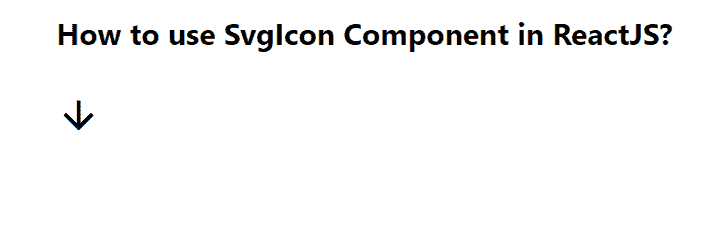

# 如何在 ReactJS 中使用 SvgIcon 组件？

> 原文:[https://www . geesforgeks . org/how-用法-svgicon-component-in-reactjs/](https://www.geeksforgeeks.org/how-to-use-svgicon-component-in-reactjs/)

我们可以使用 SvgIcon 组件在 ReactJS 中使用 SVG 图标。SvgIcons 自带内置的可访问性。React 的 Material UI 有这个组件可供我们使用，非常容易集成。我们可以使用以下方法在 ReactJS 中使用 SvgIcon 组件。

**创建反应应用程序并安装模块:**

**步骤 1:** 使用以下命令创建一个 React 应用程序。

```jsx
npx create-react-app foldername
```

**步骤 2:** 在创建项目文件夹(即文件夹名**)后，使用以下命令移动到该文件夹。**

```jsx
cd foldername
```

**步骤 3:** 创建 ReactJS 应用程序后，使用以下命令安装 **material-ui** 模块。

```jsx
npm install @material-ui/icons
```

**项目结构:**如下图。


项目结构

**示例:**现在在 **App.js** 文件中写下以下代码。在这里，App 是我们编写代码的默认组件。

## App.js

```jsx
import React from "react";
import SvgIcon from "@material-ui/core/SvgIcon";

export default function App() {
  return (
    <div style={{ display: "block", padding: 30 }}>
      <h4>How to use SvgIcon Component in ReactJS?</h4>
      <SvgIcon>
        <path d="M20 12l-1.41-1.41L13 
                 16.17V4h-2v12.17l-5.58-5.59L4 
                 12l8 8 8-8z" />
      </SvgIcon>
    </div>
  );
}
```

**运行应用程序的步骤:**从项目的根目录使用以下命令运行应用程序。

```jsx
npm start
```

**输出:**现在打开浏览器，转到***http://localhost:3000/***，会看到如下输出。



**参考:**T2】https://material-ui.com/components/icons/#svgicon