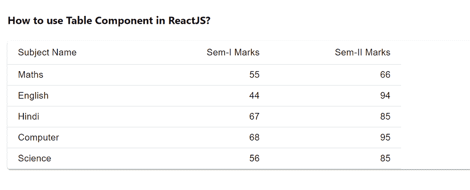

# 如何在 ReactJS 中使用表格组件？

> 原文:[https://www . geeksforgeeks . org/how-to-use-table-in-component-reactjs/](https://www.geeksforgeeks.org/how-to-use-table-component-in-reactjs/)

表格显示数据组。它们可以完全定制。【React 的 Material UI 有这个组件可供我们使用，非常容易集成。我们可以使用下面的方法在 ReactJS 中使用表组件。

**创建反应应用程序并安装模块:**

**步骤 1:** 使用以下命令创建一个 React 应用程序。

```
npx create-react-app foldername
```

**步骤 2:** 在创建项目文件夹(即文件夹名**)后，使用以下命令移动到该文件夹。**

```
cd foldername
```

**步骤 3:** 创建 ReactJS 应用程序后，使用以下命令安装 **material-ui** 模块。

```
npm install @material-ui/core
```

**项目结构:**如下图。


项目结构

**示例:**现在在 **App.js** 文件中写下以下代码。在这里，App 是我们编写代码的默认组件。

## App.js

```
import React from "react";
import TableContainer from "@material-ui/core/TableContainer";
import Table from "@material-ui/core/Table";
import TableBody from "@material-ui/core/TableBody";
import TableRow from "@material-ui/core/TableRow";
import Paper from "@material-ui/core/Paper";
import TableHead from "@material-ui/core/TableHead";
import TableCell from "@material-ui/core/TableCell";

function formatOurData(columnName, semOneMarks, semTwoMarks) {
  return { columnName, semOneMarks, semTwoMarks };
}

const SampleData = [
  formatOurData("Maths", 55, 66),
  formatOurData("English", 44, 94),
  formatOurData("Hindi", 67, 85),
  formatOurData("Computer", 68, 95),
  formatOurData("Science", 56, 85),
];

export default function App() {
  return (
    <div style={{ display: "block", padding: 30 }}>
      <h4>How to use Table Component in ReactJS?</h4>
      <TableContainer component={Paper}>
        <Table
          style={{
            width: 600,
          }}
          size="small"
        >
          <TableHead>
            <TableRow>
              <TableCell>Subject Name</TableCell>
              <TableCell align="right">
                  Sem-I Marks
              </TableCell>
              <TableCell align="right">
                  Sem-II Marks
              </TableCell>
            </TableRow>
          </TableHead>
          <TableBody>
            {SampleData.map((row) => (
              <TableRow key={row.columnName}>
                <TableCell component="th" scope="row">
                  {row.columnName}
                </TableCell>
                <TableCell align="right">
                    {row.semOneMarks}
                </TableCell>
                <TableCell align="right">
                    {row.semTwoMarks}
                </TableCell>
              </TableRow>
            ))}
          </TableBody>
        </Table>
      </TableContainer>
    </div>
  );
}
```

**运行应用程序的步骤:**从项目的根目录使用以下命令运行应用程序。

```
npm start
```

**输出:**现在打开浏览器，转到***http://localhost:3000/***，会看到如下输出。



**参考:**T2】https://material-ui.com/components/tables/