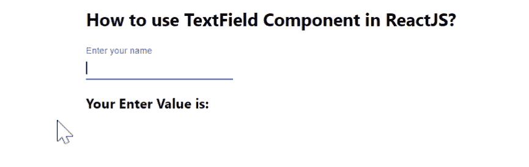

# 如何在 ReactJS 中使用 TextField 组件？

> 原文:[https://www . geeksforgeeks . org/如何使用-textfield-component-in-reactjs/](https://www.geeksforgeeks.org/how-to-use-textfield-component-in-reactjs/)

**文本字段** 组件是一个完整的表单控件，包括一个标签，输入、和帮助文本。React 的 Material UI 有这个组件可供我们使用，非常容易集成。我们可以使用以下方法在 ReactJS 中使用文本字段组件:

**创建反应应用程序并安装模块:**

**步骤 1:** 使用以下命令创建一个反应应用程序:

```jsx
npx create-react-app foldername
```

**步骤 2:** 在创建项目文件夹(即文件夹名**)后，使用以下命令将**移动到该文件夹:

```jsx
cd foldername
```

**步骤 3:** 创建 ReactJS 应用程序后，使用以下命令安装 **material-ui** 模块:

```jsx
npm install @material-ui/core
```

**项目结构:**如下图。


项目结构

**App.js:** 现在在 **App.js** 文件中写下以下代码。在这里，App 是我们编写代码的默认组件。

## java 描述语言

```jsx
import React, { useState } from "react";
import TextField from "@material-ui/core/TextField";

const App = () => {
  const [name, setName] = useState("");

  return (
    <div
      style={{
        marginLeft: "40%",
      }}
    >
      <h2>How to use TextField Component in ReactJS?</h2>
      <TextField
        value={name}
        label="Enter your name"
        onChange={(e) => {
          setName(e.target.value);
        }}
      />
      <h3>Your Enter Value is: {name} </h3>
    </div>
  );
};

export default App;
```

**运行应用程序的步骤:**从项目的根目录使用以下命令运行应用程序。

```jsx
npm start
```

**输出:**现在打开浏览器，转到***http://localhost:3000/***，会看到如下输出。

