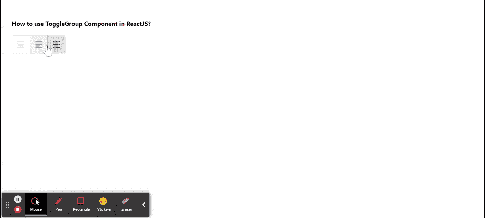

# 如何在 ReactJS 中使用 ToggleButtonGroup 组件？

> 原文:[https://www . geeksforgeeks . org/how-用法-togglebuttongroup-component-in-reactjs/](https://www.geeksforgeeks.org/how-to-use-togglebuttongroup-component-in-reactjs/)

每当用户想要对相关选项进行分组时，都会使用 **ToggleButtonGroup** 组件。【ReactJS 的 Material UI 有这个组件可供我们使用，非常容易集成。我们可以在 ReactJS 中使用以下方法来使用 ToggleButtonGroup 组件。

**创建反应应用程序并安装模块:**

**步骤 1:** 使用以下命令创建一个反应应用程序:

```jsx
npx create-react-app foldername
```

**步骤 2:** 创建项目文件夹(即文件夹名**)后，使用以下命令移动到该文件夹中:**

```jsx
cd foldername
```

**步骤 3:** 创建 ReactJS 应用程序后，使用以下命令安装 **material-ui** 模块:

```jsx
npm install @material-ui/core
npm install @material-ui/icons
npm install @material-ui/labs
```

**项目结构:**如下图。


项目结构

**示例:**现在在 **App.js** 文件中写下以下代码。在这里，App 是我们编写代码的默认组件。

## App.js

```jsx
import React from 'react';
import ToggleButton from '@material-ui/lab/ToggleButton';
import ToggleButtonGroup from '@material-ui/lab/ToggleButtonGroup';
import FormatAlignLeftIcon from '@material-ui/icons/FormatAlignLeft';
import FormatAlignJustifyIcon from '@material-ui/icons/FormatAlignJustify';
import FormatAlignCenterIcon from '@material-ui/icons/FormatAlignCenter';

export default function App() {

  const [currentAlignment, setCurrentAlignment] = React.useState('center');

  return (
    <div style={{ display: 'block', padding: 30 }}>
      <h4>How to use ToggleGroup Component in ReactJS?</h4>
      <ToggleButtonGroup
        value={currentAlignment}
        onChange={(event, newAlignment) => {
          setCurrentAlignment(newAlignment);
        }}
        exclusive
        aria-label="Demo Text Alignment"
      >
        <ToggleButton value="justify"
          aria-label="justified" disabled>
          <FormatAlignJustifyIcon />
        </ToggleButton>
        <ToggleButton value="left"
          aria-label="left aligned">
          <FormatAlignLeftIcon />
        </ToggleButton>
        <ToggleButton value="center"
          aria-label="centered">
          <FormatAlignCenterIcon />
        </ToggleButton>
      </ToggleButtonGroup>
    </div>
  );
}
```

**运行应用程序的步骤:**从项目的根目录使用以下命令运行应用程序:

```jsx
npm start
```

**输出:**现在打开浏览器，转到***http://localhost:3000/***，会看到如下输出:



**参考:**[https://material-ui . com/components/toggle-button/# toggle-buttons](https://material-ui.com/components/toggle-button/#toggle-buttons)