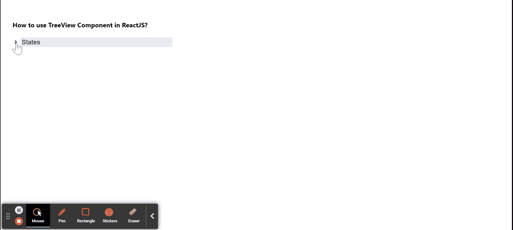

# 如何在 ReactJS 中使用 TreeView 组件？

> 原文:[https://www . geeksforgeeks . org/如何使用-treeview-in-component-reactjs/](https://www.geeksforgeeks.org/how-to-use-treeview-component-in-reactjs/)

顾名思义，一个树形视图小部件呈现一个层次列表。【React 的 Material UI 有这个组件可供我们使用，非常容易集成。我们可以在 ReactJS 中使用以下方法来使用 TreeView 组件。

**创建反应应用程序并安装模块:**

**步骤 1:** 使用以下命令创建一个反应应用程序:

```
npx create-react-app foldername
```

**步骤 2:** 创建项目文件夹(即文件夹名**)后，使用以下命令移动到该文件夹中:**

```
cd foldername
```

**步骤 3:** 创建 ReactJS 应用程序后，使用以下命令安装 **material-ui** 模块:

```
npm install @material-ui/core
npm install @material-ui/lab
npm install @material-ui/icons
```

**项目结构:**如下图。


项目结构

**示例:**现在在 **App.js** 文件中写下以下代码。在这里，App 是我们编写代码的默认组件。

## App.js

```
import React from 'react';
import ExpandMoreIcon from '@material-ui/icons/ExpandMore';
import ChevronRightIcon from '@material-ui/icons/ChevronRight';
import TreeItem from '@material-ui/lab/TreeItem';
import TreeView from '@material-ui/lab/TreeView';

export default function App() {

  return (
    <div style={{ display: 'block', padding: 30 }}>
      <h4>How to use TreeView Component in ReactJS?</h4>
      <TreeView
        style={{
          height: 240,
          maxWidth: 400,
          flexGrow: 1,
        }}
        defaultExpandIcon={<ChevronRightIcon />}
        defaultCollapseIcon={<ExpandMoreIcon />}
      >
        <TreeItem nodeId="0" label="States">
          <TreeItem nodeId="1" label="Madhya Pradesh" />
          <TreeItem nodeId="2" label="Goa" />
          <TreeItem nodeId="3" label="Delhi" />
          <TreeItem nodeId="4" label="Mumbai, etc" />
        </TreeItem>
      </TreeView>
    </div>
  );
}
```

**运行应用程序的步骤:**从项目的根目录使用以下命令运行应用程序:

```
npm start
```

**输出:**现在打开浏览器，转到***http://localhost:3000/***，会看到如下输出:



**参考:**T2】https://material-ui.com/components/tree-view/