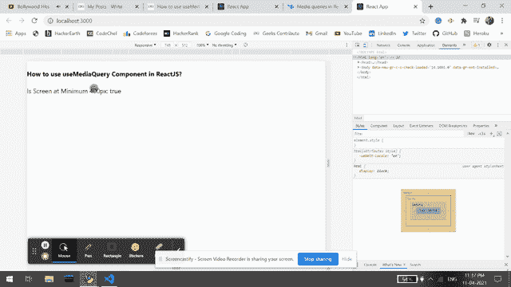

# 如何在 ReactJS 中使用 useMediaQuery 组件？

> 原文:[https://www . geeksforgeeks . org/how-use mediaquery-component-in-reactjs/](https://www.geeksforgeeks.org/how-to-use-usemediaquery-component-in-reactjs/)

useMediaQuery 组件是一个 CSS 媒体查询钩子，用于反应。使用这个功能，我们可以编写我们自己的 CSS 媒体查询，这个函数为它寻找匹配，如果匹配它就渲染。【React 的 Material UI 有这个组件可供我们使用，非常容易集成。我们可以在 ReactJS 中使用以下方法来使用 useMediaQuery 组件。

**创建反应应用程序并安装模块:**

*   **步骤 1:** 使用以下命令创建一个反应应用程序:

    ```
    npx create-react-app foldername
    ```

*   **步骤 2:** 创建项目文件夹(即文件夹名**)后，使用以下命令移动到该文件夹中:**

    ```
    cd foldername
    ```

*   **步骤 3:** 创建 ReactJS 应用程序后，使用以下命令安装 **material-ui** 模块:

    ```
    npm install @material-ui/core/useMediaQuery
    ```

    **项目结构:**如下图。

    

    项目结构

    **示例:**现在在 **App.js** 文件中写下以下代码。在这里，App 是我们编写代码的默认组件。

    ## App.js

    ```
    import React from 'react';
    import useMediaQuery from '@material-ui/core/useMediaQuery';

    export default function App() {
      const ourMediaQuery = useMediaQuery('(min-width:400px)');
      return (
        <div style={{ display: 'block'}}>
          <h4>How to use useMediaQuery Component in ReactJS?</h4>
          <span>{`Is Screen at Minimum 400px: ${ourMediaQuery}`}</span>
        </div>
      );
    }
    ```

    **运行应用程序的步骤:**从项目的根目录使用以下命令运行应用程序:

    ```
    npm start
    ```

    **输出:**现在打开浏览器，转到***http://localhost:3000/***，会看到如下输出:

    

    **参考:**T2】https://material-ui.com/components/use-media-query/