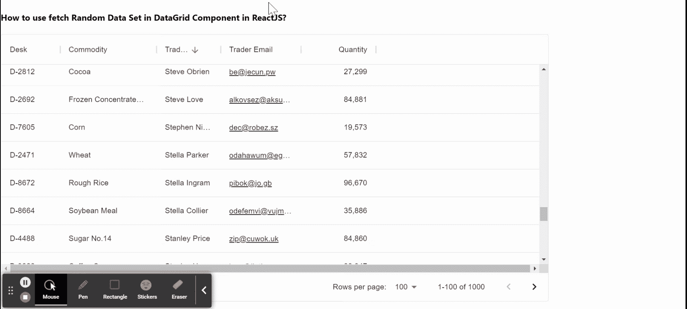

# 如何在 ReactJS 中使用 x-grid-data-generator 模块？

> 原文:[https://www . geeksforgeeks . org/如何使用-x-grid-data-generator-module-in-reactjs/](https://www.geeksforgeeks.org/how-to-use-x-grid-data-generator-module-in-reactjs/)

每当我们想要为网格组件生成一些数据和构建演示时，我们可以使用***x-grid-data-generator***模块。它有一个大品种的数据集可以玩。数据网格组件有助于以类似网格的行和列格式显示信息。我们可以在 ReactJS 中使用以下方法来使用 *x 网格数据生成器*模块。

**方法:**按照这些简单的步骤来使用 ReactJS 中的 *x 网格数据生成器*模块。在下面的例子中，我们已经从这个模块中导入了 *useDemoData* 函数，然后通过传递数据集名称以及 rowLength 和 maxColumns 属性来使用这个函数中的公共数据集。之后，我们将数据对象传递给我们的数据网格组件，以便向用户显示它。

**创建反应应用程序并安装模块:**

*   **步骤 1:** 使用以下命令创建一个反应应用程序:

    ```
    npx create-react-app foldername
    ```

*   **步骤 2:** 创建项目文件夹(即文件夹名**)后，使用以下命令移动到该文件夹中:**

    ```
    cd foldername
    ```

*   **步骤 3:** 创建 ReactJS 应用程序后，使用以下命令安装 **material-ui** 模块:

    ```
    npm install @material-ui/data-grid
    npm install @material-ui/x-grid-data-generator
    ```

**项目结构:**如下图。


项目结构

**示例:**现在在 **App.js** 文件中写下以下代码。在这里，App 是我们编写代码的默认组件。

## App.js

```
import * as React from 'react';
import { DataGrid } from '@material-ui/data-grid';
import { useDemoData } from '@material-ui/x-grid-data-generator';

export default function App() {

  const { data } = useDemoData({
    dataSet: 'Commodity',
    rowLength: 1000,
    maxColumns: 6,
  });

  return (
   <div style={{ height: 500, width: '80%' }}>
    <h4>
     How to use fetch Random Data Set in 
     DataGrid Component in ReactJS?
    </h4>
     <DataGrid  {...data}/>
   </div>
  );
}
```

**运行应用程序的步骤:**从项目的根目录使用以下命令运行应用程序:

```
npm start
```

**输出:**现在打开浏览器，转到***http://localhost:3000/***，会看到如下输出:



**参考:**[https://www . npmjs . com/package/@ material-ui/x-grid-data-generator](https://www.npmjs.com/package/@material-ui/x-grid-data-generator)