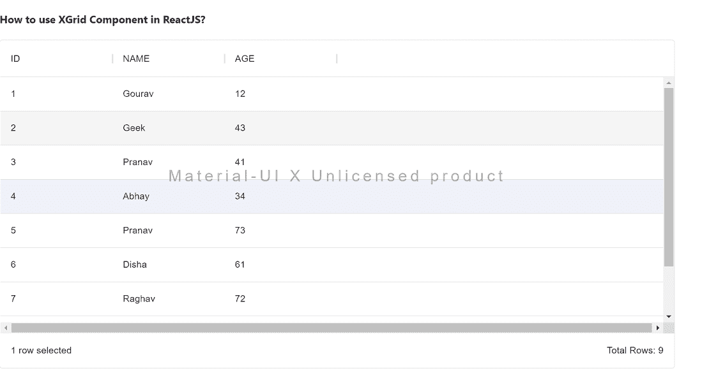

# 如何在 ReactJS 中使用 XGrid 组件？

> 原文:[https://www . geeksforgeeks . org/如何使用-xgrid-in-component-reactjs/](https://www.geeksforgeeks.org/how-to-use-xgrid-component-in-reactjs/)

XGrid 组件是 MaterialUI 组件的商业版本。它在社区数据网格组件上提供了更多增强的特性，如列大小调整、列重新排序、分页超过 100 行等。数据网格组件有助于以类似网格的行和列格式显示信息。React 的 Material UI 有这个组件可供我们使用，非常容易集成。我们可以在 ReactJS 中使用以下方法来使用 XGrid 组件。

**方法:**按照这些简单的步骤在 ReactJS 中使用 XGrid 组件。在下面的例子中，我们已经导入了类似于数据网格组件的 XGrid 组件，只是增加了一些功能，因为它是一个带有定价的企业版。在行和列属性的帮助下，我们将示例数据传递给了它，并定义了我们的行大小。

**创建反应应用程序并安装模块:**

*   **步骤 1:** 使用以下命令创建一个反应应用程序:

    ```
    npx create-react-app foldername
    ```

*   **步骤 2:** 创建项目文件夹(即文件夹名**)后，使用以下命令移动到该文件夹中:**

    ```
    cd foldername
    ```

*   **步骤 3:** 创建 ReactJS 应用程序后，使用以下命令安装 **material-ui** 模块:

    ```
    npm install @material-ui/x-grid
    ```

**项目结构:**如下图。


项目结构

**示例:**现在在 **App.js** 文件中写下以下代码。在这里，App 是我们编写代码的默认组件。

## App.js

```
import * as React from 'react';
import { XGrid } from '@material-ui/x-grid';

const columns = [
  { field: 'id', headerName: 'ID', width: 170 },
  { field: 'name', headerName: 'NAME', width: 170 },
  { field: 'age', headerName: 'AGE', width: 170 },
];

const rows = [
  { id: 1, name: 'Gourav', age: 12 },
  { id: 2, name: 'Geek', age: 43 },
  { id: 3, name: 'Pranav', age: 41 },
  { id: 4, name: 'Abhay', age: 34 },
  { id: 5, name: 'Pranav', age: 73 },
  { id: 6, name: 'Disha', age: 61 },
  { id: 7, name: 'Raghav', age: 72 },
  { id: 8, name: 'Amit', age: 24 },
  { id: 9, name: 'Anuj', age: 48 },
];

export default function App() {

  return (
    <div style={{ height: 500, width: '80%' }}>
      <h4>How to use XGrid Component in ReactJS?</h4>
      <XGrid rows={rows} columns={columns} pageSize={5} 
      />
    </div>
  );
}
```

**运行应用程序的步骤:**从项目的根目录使用以下命令运行应用程序:

```
npm start
```

**输出:**现在打开浏览器，转到***http://localhost:3000/***，会看到如下输出:



**参考:**[https://material-ui . com/components/data-grid/# commercial-version](https://material-ui.com/components/data-grid/#commercial-version)