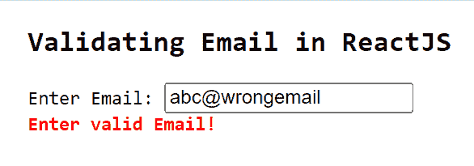
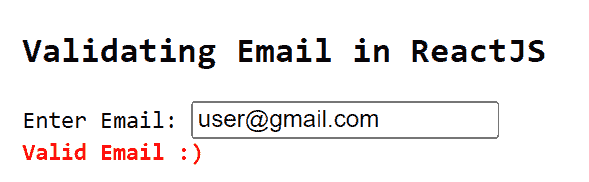

# 如何在 ReactJS 中验证电子邮件？

> 原文:[https://www . geeksforgeeks . org/如何验证电子邮件 in-reactjs/](https://www.geeksforgeeks.org/how-to-validate-an-email-in-reactjs/)

电子邮件验证是每个应用程序中验证用户电子邮件的重要步骤。可以使用 ReactJS 中的**验证器**模块来实现。以下示例显示了如何使用 React Application 中的 npm 模块验证用户输入的电子邮件并检查其是否有效。

**创建反应应用程序并安装模块:**

**步骤 1:** 使用以下命令创建一个反应应用程序:

```jsx
npx create-react-app emailvalidatordemo
```

**步骤 2:** 创建项目文件夹后，即 **emailvalidatordemo，**使用以下命令移动到该文件夹:

```jsx
cd emailvalidatordemo
```

**步骤 3:** 创建反应应用程序后，使用以下命令安装**验证器**模块:

```jsx
npm install validator
```

**项目结构:**将如下图。


项目结构

**App.js:** 现在在 **App.js** 文件中写下以下代码。在这里，应用程序是我们的默认组件，我们已经编写了代码来使用基本的用户界面验证电子邮件。

## java 描述语言

```jsx
import React, { useState } from "react";
import validator from 'validator'

const App = () => {

  const [emailError, setEmailError] = useState('')
  const validateEmail = (e) => {
    var email = e.target.value

    if (validator.isEmail(email)) {
      setEmailError('Valid Email :)')
    } else {
      setEmailError('Enter valid Email!')
    }
  }

  return (
    <div style={{
      margin: 'auto',
      marginLeft: '300px',
    }}>
      <pre>
        <h2>Validating Email in ReactJS</h2>
        <span>Enter Email: </span><input type="text" id="userEmail" 
        onChange={(e) => validateEmail(e)}></input> <br />
        <span style={{
          fontWeight: 'bold',
          color: 'red',
        }}>{emailError}</span>
      </pre>
    </div>
  );
}

export default App
```

**运行应用程序的步骤:**从项目的根目录使用以下命令运行应用程序:

```jsx
npm start
```

**输出:**

*   如果用户输入如下所示的无效电子邮件，将输出以下内容:



*   如果用户输入如下所示的有效电子邮件，将输出以下内容:

