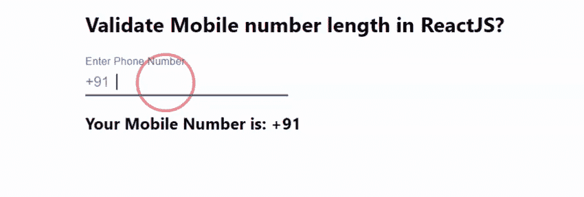

# 如何在 ReactJS 中验证手机号码长度？

> 原文:[https://www . geeksforgeeks . org/如何验证移动号码长度-in-reactjs/](https://www.geeksforgeeks.org/how-to-validate-mobile-number-length-in-reactjs/)

验证手机号码长度是检查用户输入的号码是否真实的重要步骤。React 的 Material UI 有这个组件可供我们使用，非常容易集成。我们可以使用以下方法在 ReactJS 中使用文本字段组件的错误属性。

**创建反应应用程序并安装模块:**

**步骤 1:** 使用以下命令创建一个反应应用程序:

```
npx create-react-app foldername
```

**步骤 2:** 创建项目文件夹(即文件夹名**)后，使用以下命令移动到该文件夹中:**

```
cd foldername
```

**步骤 3:** 创建 ReactJS 应用程序后，使用以下命令安装 **material-ui** 模块:

```
npm install @material-ui/core
```

**项目结构:**如下图。


项目结构

**App.js:** 现在在 **App.js** 文件中写下以下代码。在这里，App 是我们编写代码的默认组件。

## java 描述语言

```
import React, { useState } from "react";
import TextField from "@material-ui/core/TextField";
import InputAdornment from "@material-ui/core/InputAdornment";

const App = () => {
  const [mobile, setmobile] = useState("");
  const [isError, setIsError] = useState(false);

  return (
    <div
      style={{
        marginLeft: "40%",
      }}
    >
      <h2>Validate Mobile number length in ReactJS?</h2>
      <TextField
        type="tel"
        error={isError}
        value={mobile}
        label="Enter Phone Number"
        onChange={(e) => {
          setmobile(e.target.value);
          if (e.target.value.length > 10) {
            setIsError(true);
          }
        }}
        InputProps={{
          startAdornment: <InputAdornment position="start">
             +91
             </InputAdornment>,
        }}
      />
      <h3>Your Mobile Number is: +91 {mobile} </h3>
    </div>
  );
};

export default App;
```

**运行应用程序的步骤:**从项目的根目录使用以下命令运行应用程序。

```
npm start
```

**输出:**现在打开浏览器，转到***http://localhost:3000/***，会看到如下输出。在上面的例子中，我们可以看到当用户超过 10 位数字时，TextField 颜色变为红色表示错误，这就是我们如何在 ReactJS 中验证手机号码长度。

