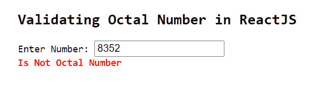
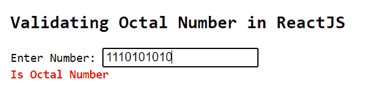

# 如何在 ReactJS 中验证八进制数？

> 原文:[https://www . geeksforgeeks . org/如何验证八进制数 in-reactjs/](https://www.geeksforgeeks.org/how-to-validate-octal-number-in-reactjs/)

O****ctal**数字系统是基数-8 **数字** 系统使用数字 0 到 7。它也被简称为。以下示例显示了如何使用 ReactJS 应用程序中的 npm 模块验证用户输入的数据并检查其是否有效。**

****创建反应应用程序并安装模块:****

****步骤 1:** 使用以下命令创建一个反应应用程序:**

```jsx
npx create-react-app foldername
```

****步骤 2:** 在创建项目文件夹(即文件夹名**)后，使用以下命令将**移动到该文件夹:**

```jsx
cd foldername
```

****步骤 3:** 创建 ReactJS 应用程序后，使用以下命令安装**验证器**模块:**

```jsx
npm install validator
```

****项目结构:**如下图。**

**

项目结构** 

****App.js:** 现在在 **App.js** 文件中写下以下代码。在这里，App 是我们编写代码的默认组件。**

## **java 描述语言**

```jsx
import React, { useState } from "react";
import validator from 'validator'

const App = () => {

  const [errorMessage, setErrorMessage] = useState('')

  const validate = (value) => {

    if (validator.isOctal(value)) {
      setErrorMessage('Is Octal Number')
    } else {
      setErrorMessage('Is Not Octal Number')
    }
  }

  return (
    <div style={{
      marginLeft: '200px',
    }}>
      <pre>
        <h2>Validating Octal Number in ReactJS</h2>
        <span>Enter Number: </span><input type="text" 
        onChange={(e) => validate(e.target.value)}></input> <br />
        <span style={{
          fontWeight: 'bold',
          color: 'red',
        }}>{errorMessage}</span>
      </pre>
    </div>
  );
}

export default App
```

****运行应用程序的步骤:**从项目的根目录使用以下命令运行应用程序:**

```jsx
npm start
```

****输出:****

*   **如果用户输入一个无效的八进制数，如下所示，输出如下:**

****

*   **如果用户输入有效的八进制数，输出如下:**

****