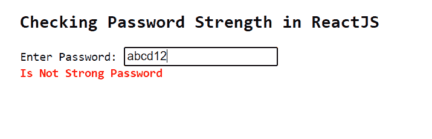
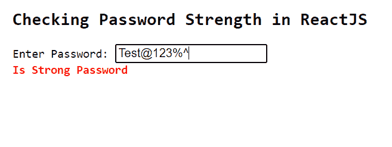

# ReactJS 中如何验证密码是否强？

> 原文:[https://www . geeksforgeeks . org/如何验证密码是强还是不在 reactjs/](https://www.geeksforgeeks.org/how-to-validate-password-is-strong-or-not-in-reactjs/)

密码必须很强，这样黑客才不会轻易破解。以下示例显示了如何在 ReactJS 中检查用户输入密码的密码强度。

**语法:**

```jsx
isStrongPassword(str [, options])
```

**参数:**该函数接受两个参数，如上所述，如下所述:

*   **字符串:**是字符串类型的输入值。
*   **选项**:可选参数。这些是检查输入密码的选项。例如最小长度、最小小写等。

**创建反应应用程序并安装模块:**

**步骤 1:** 使用以下命令创建一个反应应用程序:

```jsx
npx create-react-app foldername
```

**步骤 2:** 在创建项目文件夹(即文件夹名**)后，使用以下命令将**移动到该文件夹:

```jsx
cd foldername
```

**步骤 3:** 创建 ReactJS 应用程序后，使用以下命令安装**验证器**模块:

```jsx
npm install validator
```

**项目结构:**如下图。


项目结构

**App.js:** 现在在 **App.js** 文件中写下以下代码。在这里，App 是我们编写代码的默认组件。

## java 描述语言

```jsx
import React, { useState } from "react";
import validator from 'validator'

const App = () => {

  const [errorMessage, setErrorMessage] = useState('')

  const validate = (value) => {

    if (validator.isStrongPassword(value, {
      minLength: 8, minLowercase: 1,
      minUppercase: 1, minNumbers: 1, minSymbols: 1
    })) {
      setErrorMessage('Is Strong Password')
    } else {
      setErrorMessage('Is Not Strong Password')
    }
  }

  return (
    <div style={{
      marginLeft: '200px',
    }}>
      <pre>
        <h2>Checking Password Strength in ReactJS</h2>
        <span>Enter Password: </span><input type="text"
          onChange={(e) => validate(e.target.value)}></input> <br />
        <span style={{
          fontWeight: 'bold',
          color: 'red',
        }}>{errorMessage}</span>
      </pre>
    </div>
  );
}

export default App
```

**运行应用程序的步骤:**从项目的根目录使用以下命令运行应用程序:

```jsx
npm start
```

**输出:**

*   如果用户输入弱密码，将会输出以下内容。



*   如果用户输入了一个强密码，下面将是输出。

