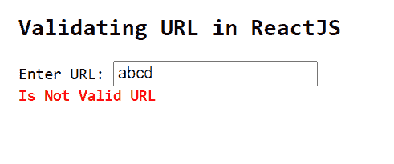
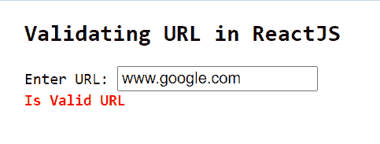

# 如何在 ReactJS 中验证 URL？

> 原文:[https://www . geeksforgeeks . org/如何验证 url-in-reactjs/](https://www.geeksforgeeks.org/how-to-validate-url-in-reactjs/)

**URL(统一资源定位符)** 是对互联网上的资源 的引用/地址。例如、*www.geeksforgeeks.com*就是一个 URL。以下示例显示了如何使用 ReactJS 应用程序中的 npm 模块验证用户输入的数据并检查其是否有效。

**创建反应应用程序并安装模块:**

**步骤 1:** 使用以下命令创建一个反应应用程序:

```
npx create-react-app foldername
```

**步骤 2:** 创建项目文件夹(即文件夹名**)后，使用以下命令移动到该文件夹中:**

```
cd foldername
```

**步骤 3:** 创建 ReactJS 应用程序后，使用以下命令安装**验证器**模块:

```
npm install validator
```

**项目结构:**如下图。


项目结构

**App.js:** 现在在 **App.js** 文件中写下以下代码。在这里，App 是我们编写代码的默认组件。

## java 描述语言

```
import React, { useState } from "react";
import validator from 'validator'

const App = () => {

  const [errorMessage, setErrorMessage] = useState('')

  const validate = (value) => {

    if (validator.isURL(value)) {
      setErrorMessage('Is Valid URL')
    } else {
      setErrorMessage('Is Not Valid URL')
    }
  }

  return (
    <div style={{
      marginLeft: '200px',
    }}>
      <pre>
        <h2>Validating URL in ReactJS</h2>
        <span>Enter URL: </span><input type="text" 
        onChange={(e) => validate(e.target.value)}></input> <br />
        <span style={{
          fontWeight: 'bold',
          color: 'red',
        }}>{errorMessage}</span>
      </pre>
    </div>
  );
}

export default App
```

**运行应用程序的步骤:**从项目的根目录使用以下命令运行应用程序:

```
npm start
```

**输出:**

*   如果用户输入如下所示的无效网址，将会输出以下内容:



*   如果用户输入如下所示的有效网址，将输出以下内容:

