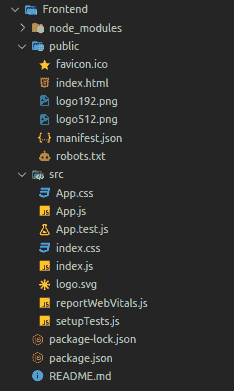
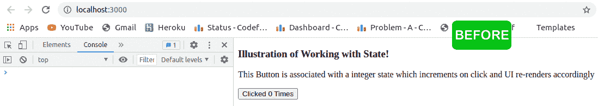

# 如何在 React 中处理和操纵状态？

> 原文:[https://www . geeksforgeeks . org/如何在反应中处理和操纵状态/](https://www.geeksforgeeks.org/how-to-work-with-and-manipulate-state-in-react/)

React 中的[组件](https://www.geeksforgeeks.org/reactjs-components/)提供了 JSX(如果你是一个初学者，考虑一下它有点类似于 HTML)，它可以包含 HTML 标签和 javascript 表达式，ReactDOM 以某种方式处理它，并相应地在前端显示一些东西。一切都很好，直到你只需要显示静态内容，但是如果你的网站是动态的，你必须根据用户交互在前端改变一些东西呢？在这种情况下，你可以使用像事件和事件处理程序这样的东西来与用户交互，或者可能使用其他几个内部的东西，比如动态调整等。但是你如何告诉 ReactDOM，根据用户交互所发生的一些变化来显示一些东西。

**方法:**用 ReactDOM 重新渲染组件的方法是通过[状态](https://www.geeksforgeeks.org/reactjs-state-react/)改变。它是 react 组件中的一个内置对象，具有一些预定义的功能，并包含一些关于将在前端呈现的用户界面的信息，它还控制组件的整个行为。我们可以利用 state 对象在组件上抛出信息，这样 ReactDOM 就可以根据这些信息呈现一些东西，基本上，它是组件的动态数据存储。我们还可以出于不同的目的在内部管理状态，状态力的变化会对调用 render 函数做出反应，以及在功能组件的情况下管理其他生命周期方法/钩子。

**创建 react app 并安装模块:**

**步骤 1:** 创建反应应用程序

```jsx
npx create-react-app state-demo
```

**步骤 2:** 创建项目文件夹(即文件夹名)后，使用以下命令移动到该文件夹:

```jsx
cd state-demo
```

**项目结构:**如下图。



现在首先我们来看看如何用[类组件](https://www.geeksforgeeks.org/reactjs-class-based-components/)创建和操纵状态。

**1。** **初始化状态:**

**语法:**

*   **初始化构造函数内的状态对象**

    ```jsx
    constructor() {
        super();  // Don’t Forget to pass props if received
        this.state = {
            // Any object
        };
    }
    ```

*   **使用类属性**

    ```jsx
    class MyComponent extends React.Component {
        state = {
            // any object
        };
    }
    ```

    初始化状态对象

**2。访问状态:**我们可以使用“ **this.state”在组件中的任何地方访问状态对象，**状态是本地的，所以不要试图从外部组件访问它，如果您在外部需要它，那么您可以通过某种方式将其作为道具传递。

**3。操纵状态:**类组件为我们提供了一个**设置状态**函数，我们可以在组件的任何地方调用它来操纵状态。

*   调用 setState 时，用提供的对象作为参数更改状态对象。

    ```jsx
    this.setState({
        // anyobject
    });
    ```

*   当我们必须基于先前的状态进行更新时，我们传递一个函数，该函数获取先前的状态作为参数。

    ```jsx
    this.setState((prevState) => {
        // Do return a new state object 
        // after some manipulations 
    });
    ```

*   setState 动作是异步的，所以当我们必须在状态更新后严格地做一些事情(例如获取动态内容、内部更改组件等)时，我们会将一个回调函数作为第二个参数传递给 setState 函数。

**示例:**在这个示例中，我们使用了基于类的组件，并打印了一行来指示回调函数在状态更新后立即执行，这可以在状态更新后我们必须严格执行一些代码时使用，这个场景的一个简单用例可以是通过 API 获取任何动态内容，即当我们从 GFG 主页点击算法部分时，它会获取所有主题的列表，这可以通过 setState 回调函数内部的 GET 请求来完成，该回调函数设置了单击的算法按钮。

## App.js

```jsx
import React from 'react';
import ReactDOM from 'react-dom';

class MyComponent extends React.Component {
    constructor(){
        super();

        this.state = {
            clicked:0
        }
    }
    stateManipulater = ()=>{
        this.setState((prevState)=>{
           return {clicked:prevState.clicked+1};
        }, ()=>{            
        console.log("This line will only get "
          + "printed after state gets updated");  
        })
    }

 render (){
    return <div><h3>Illustration of Working with State!</h3> 

    <p>
        This Button is associated with an integer state 
        which increments on click and UI re-renders 
        accordingly
    </p>

    <button onClick={this.stateManipulater} >
        {`Clicked ${this.state.clicked} Times`} 
    </button></div>
 }
}

ReactDOM.render(
    <MyComponent/>,    // What to Display
    document.getElementById('root')   // Where to Display
);
```

#### 输出:



**解释:**这是上面代码的输出，就在点击按钮之后，生成了调用 this.setState 函数来操纵状态的事件，紧接着，回调函数作为第二个参数传递给 this.setState 执行，命令行打印在控制台上。

现在我们来看看如何在[功能组件](https://www.geeksforgeeks.org/reactjs-functional-components/)中使用和操纵状态。

**语法:**

**1。初始化状态:**我们有 useState 钩子来处理功能组件中的状态， [useState](https://www.geeksforgeeks.org/reactjs-usestate-hook/) 接收初始状态作为参数，并返回状态变量和一个函数，该函数稍后可以用来设置与之相关的状态。

```jsx
const [state, setState] = useState(intialState);

// Note:- You are not restricted to name state variable
// as "state" and function as "setState"
```

**2。访问状态:**我们可以在像“**状态**这样的功能组件中的任何地方直接访问带有名称的状态。

**3。操作状态:**我们从 useState 接收的函数用于操作关联的状态变量。

*   调用时用提供的对象作为参数更改状态对象。

```jsx
setState(arg);
```

*   当我们必须基于先前的状态进行更新时，我们传递一个函数，该函数获取先前的状态作为参数。

```jsx
setState((prevState)=>{
    // Do return a new state object after some manipulations 
});
```

*   与类不同的是，当状态改变时，函数组件不为我们提供回调，但是可以使用 useEffect 钩子来实现同样的效果， [useEffect](https://www.geeksforgeeks.org/reactjs-useeffect-hook/) 每当依赖数组中的某个东西改变时都会调用给定的函数。

**示例:**在这个示例中，我们正在打印一行，以指示回调函数在状态更新后立即执行，这可以在状态更新后我们必须严格执行一些执行时使用，这个场景的一个简单用例可以是通过 API 获取任何动态内容，即。当我们从极客主页点击算法部分时，它会获取所有主题的列表，这可以通过 setState 回调函数中的 GET 请求来完成，setState 设置点击的算法按钮。

## App.js

```jsx
import React, { useEffect, useState } from 'react';
import ReactDOM from 'react-dom';

function MyComponent (){
    const [state, setState] = useState({clicked:0});

    const stateManipulater = ()=>{
        setState((prevState)=>{
           return {clicked:prevState.clicked+1};
        })
    }
    useEffect(()=>{    
        console.log("This line will only get "
        + "printed after state gets updated");  
    }, [state])

    return <div><h3>Illustration of Working with State!</h3> 
        <p>
            This Button is associated with an integer
            state which increments on click and UI 
            re-renders accordingly 
        </p>

        <button onClick={stateManipulater} > 
        {`Clicked ${state.clicked} Times`} </button>
    </div>
}

ReactDOM.render(
    <MyComponent/>,    // What to Display
    document.getElementById('root')   // Where to Display
);
```

**运行应用程序的步骤:**从项目的根目录使用以下命令运行应用程序:

```jsx
npm start
```

**输出:**现在打开浏览器，转到***http://localhost:3000/***，会看到如下输出:


**解释:**这是上面代码的输出，就在点击按钮之后，状态被事件处理程序改变了，紧接着，组件注意到 useEffect 的依赖数组中的某个东西被改变了，因此立即执行它的功能，我们只在其中写入了控制台日志，所以该行在状态改变之后被打印出来。

**工作状态下需要记住的点:**

1.永远不要显式地更改状态，因为这样 react 将无法观察到状态的变化，并且组件的行为也不会受到影响，所以始终使用组件提供的 setState 函数。

2.正如您所理解的，状态更改会导致组件的重新呈现，因此请始终关注状态更改的地方，有时小错误可能会导致额外的或最坏的情况下无限的重新呈现，这将导致您的应用程序变慢。

3.如果您在 state 对象或数组中有多个元素，并且您只需要更改一个元素，那么不要忘记分散数据，否则它将使用该单个元素覆盖对象/数组，因为状态会随着浅层合并而更新。

4.更新状态后不要依赖于状态肯定会更新的事实，在某些情况下，由于 REACT 的内部工作可能会花费一点时间，因此如果您立即使用更新的状态，确实会创建自己的状态。