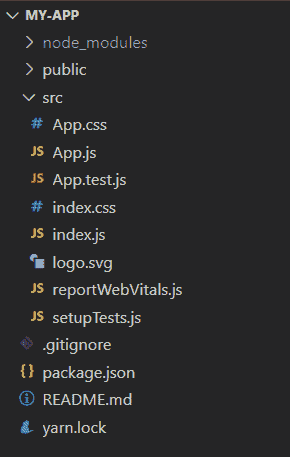
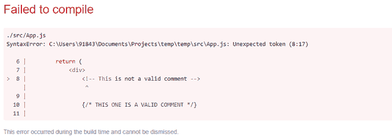

# 如何在 ReactJS 中写评论？

> 原文:[https://www . geesforgeks . org/how-write-comments-in-reactjs/](https://www.geeksforgeeks.org/how-to-write-comments-in-reactjs/)

**ReactJS** 是一个用于构建用户界面的 JavaScript 库。它是声明性的、基于组件的和技术栈不可知的。它是为速度、简单性和可扩展性而设计的。这些特性使它成为 web 开发人员中最受欢迎的库之一。

在本文中，我们将探索创建一个 React 应用程序并向其添加注释。

#### 创建反应应用程序

**步骤 1:** 使用以下命令创建一个反应应用程序:

```
npx create-react-app my-app
```

**步骤 2:** 使用以下命令移动到项目文件夹*我的应用程序*:

```
cd my-app
```

**步骤 3:** 使用以下命令启动开发服务器:

```
yarn start
```

(这将在 localhost:3000 运行您的应用程序，在这里您可以看到对应用程序所做的所有更改。)

**项目结构:**如下图。



**实施例 1:** 反应组分注释。我们可以在 React 中使用双正斜杠//或星号格式/* */编写注释，类似于常规的 JavaScript。

## App.js

```
import React, { Component } from 'react';

// This is a comment

class App extends Component {

    /* This is 
    also a comment*/
    render() {
        return (
            <div>
                <h1>Welcome to GeeksforGeeks</h1>
            </div>
        );
    }
}

export default App;
```

**输出:**


**示例 2:** 当我们想要评论**渲染块**内部的东西时，上面的示例不起作用。这是因为我们在渲染块中使用了 JSX，并且必须在大括号{/* */}中使用多行注释。

## App.js

```
import React, { Component } from 'react';

class App extends Component {
    render() {
        return (      
            <div>
                // This is not a valid comment
                /* Neither is this */

                {/* THIS ONE IS A VALID COMMENT */}

                <h1>Welcome to GeeksforGeeks</h1>
            </div>
        );
    }
}

export default App;
```

**输出:**


**注意:**我们必须记住，即使 JSX 像普通的 HTML 一样被渲染，它实际上是 JavaScript 的语法扩展。所以，利用<！––>就像我们对 HTML 和 XML 所做的那样，是行不通的。

## App.js

```
import React, { Component } from 'react';

class App extends Component {
    render() {
        return (     
            <div>
                <!-- This is not a valid comment -->

                {/* THIS ONE IS A VALID COMMENT */}

                <h1>Welcome to GeeksforGeeks</h1>
            </div>
        );
    }
}

export default App;
```

**输出:**

