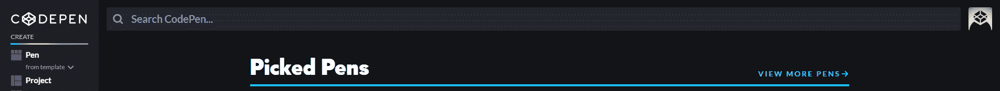

# 如何在 Codepen 中编写 ReactJS 代码。IO？

> 原文:[https://www . geesforgeks . org/how-write-reactjs-code-in-codepen-io/](https://www.geeksforgeeks.org/how-to-write-reactjs-code-in-codepen-io/)

现在一切都在线了，有人用 VScode 写 react.js 代码，面临大部分的困难。VScode 需要设置来编写 React.js 代码，很多初学者使用 VScode 都面临困难，所以对于他们来说，使用 **[codepen](https://codepen.io/)** 是好的，也是容易的。codepen 为您提供了一个在线平台来创建反应，HTML，CSS，JavaScript 项目。Codepen 还有另一个优势，那就是你可以轻松地将你的代码上传到 GitHub，并且毫无困难地与任何人分享你的代码。Codepen 还有一个好处，你会看到其他人的项目和代码，它成为学习项目的更好方法。
02
**如何调整并开始使用 Codepen:**

*   **第一步:**先参观 **[码本](https://codepen.io/)** 官方网站。
*   **第二步:**现在你必须在 codepen.io 中创建一个账户，你可以通过脸书、推特、GitHub 或者使用 Email 注册。
    T3】
*   **第三步:**然后点击窗口右上角的个人资料，访问新笔。
    
*   **第四步:**现在进入设置，点击 js。选择巴贝尔作为 javascript 预处理器，在搜索栏中输入 React 导入 React 和 React-dom 为 React-dom CDNjs，然后保存并关闭。

现在在相应的块中编写 JavaScript、HTML 和 CSS 代码。编写完代码后，点击保存按钮，现在如果您的代码没有错误，那么它将成功运行并显示输出。