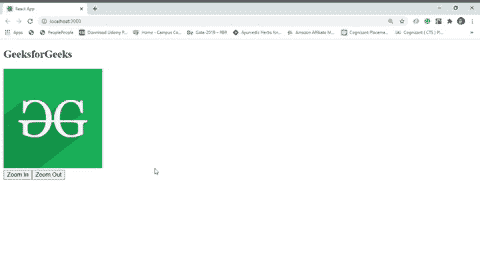

# 如何使用 ReactJS 进行图像的放大和缩小？

> 原文:[https://www . geeksforgeeks . org/如何使用-reactjs/](https://www.geeksforgeeks.org/how-to-zoom-in-and-zoom-out-image-using-reactjs/) 放大和缩小图像

React 是一个用于构建用户界面的 JavaScript 库。React 使创建交互式用户界面变得轻松。为应用程序中的每个状态设计简单的视图，当数据发生变化时，React 将高效地更新和呈现正确的组件。

在 ReactJS 中，我们写的任何看起来像 HTML 的东西实际上都不是纯 HTML。所有看起来像 HTML 的东西都是 JSX 的，在场景后面，它们被转换成使用巴别塔的普通 JavaScript。这些都以这种方式工作，让开发人员的生活更轻松。因为 JSX 不是超文本标记语言，这就是为什么我们可以直接引用超文本标记语言元素，这就是为什么我们不能直接获取任何超文本标记语言元素的属性。为了获取元素的属性，React 给出了一个叫做“ref”的东西。使用 ref，我们可以创建对任何 HTML 元素的直接引用，并控制 HTML 元素的属性。这里我们使用“参考”系统来获取图像的高度和宽度。在获得图像的高度和宽度后，我们设置了一个点击处理程序，并增加了图像的尺寸，该尺寸被淡入 DOM 属性。

**示例:**此示例说明了如何使用 react 缩放图像

*   **index.js:**

## java 描述语言

```jsx
import React from 'react'
import ReactDOM from 'react-dom'
import App from './App'

ReactDOM.render(<App />, document.querySelector('#root'))
```

*   **App.js:**

## java 描述语言

```jsx
import React, { Component } from 'react'
class App extends Component{
  constructor(props){
    super(props)

    // Initializing states
    this.state = {height:null, width:null}

    // Bind context of 'this'
    this.handleZoomIn = this.handleZoomIn.bind(this)
    this.handleZoomOut = this.handleZoomOut.bind(this)

    // Create reference of DOM object
    this.imgRef = React.createRef()
  }

  componentDidMount(){
    // Saving initial dimension of image as class properties
    this.initialHeight = this.imgRef.current.clientHeight
    this.initialWidth = this.imgRef.current.clientWidth
  }

  // Event handler callback for zoom in
  handleZoomIn(){

    // Fetching current height and width
    const height = this.imgRef.current.clientHeight
    const width = this.imgRef.current.clientWidth

    // Increase dimension(Zooming)
    this.setState({
      height : height + 10,
      width : width + 10,
    }) 
  }

  // Event handler callback zoom out
  handleZoomOut(){

    // Assigning original height and width
    this.setState({
      height : this.initialHeight,
      width : this.initialWidth,
    })
  }

  render(){
    // Assign current height and width to the image
    const imgStyle = { height : this.state.height, width: this.state.width}
    return(
      <div>
        <h2>GeeksforGeeks</h2>
        {/* Assign reference to DOM element     */}
        
        <div>
          <button onClick={this.handleZoomIn}>Zoom In</button>
          <button onClick={this.handleZoomOut}>Zoom Out</button>
        </div>
      </div>   
    ) 
  }
}
export default App
```

**输出:**

