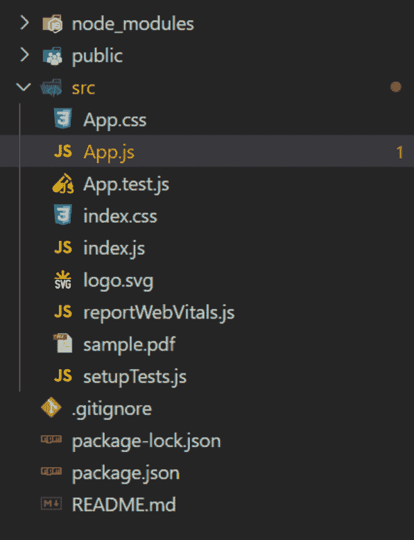
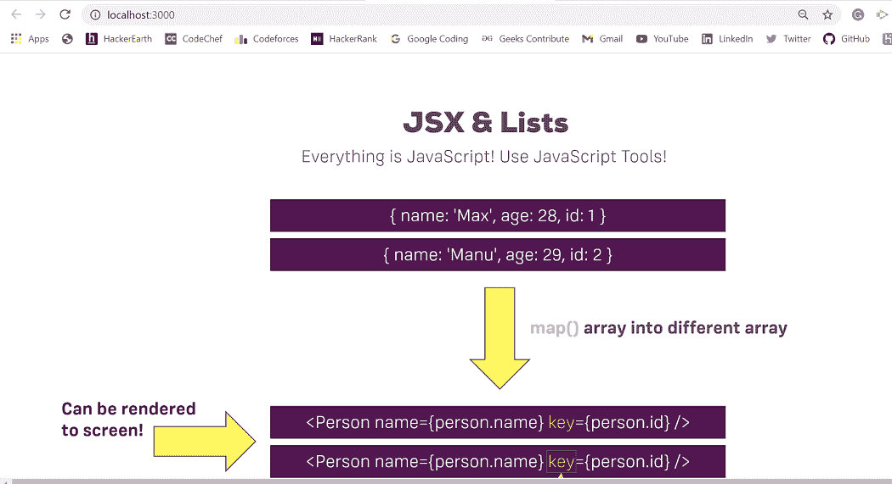

# 如何在 ReactJS 中使用 React-PDF 进行放大/缩小？

> 原文:[https://www . geeksforgeeks . org/如何使用-react-pdf-in-reactjs/](https://www.geeksforgeeks.org/how-to-zoom-in-zoom-out-using-react-pdf-in-reactjs/)

通过在 **<页面/ >** 组件中传递一个名为**缩放**的道具，我们可以在 ReactJS 中使用 React-PDF 轻松进行放大/缩小。Scale prop 只接受十进制形式的值，这意味着即使你想传递一个整数值，你也应该在它后面加上十进制。大于 1 的值将放大页面，小于 1 的值将缩小页面。

**语法:**

```
<page scale = {value} />
```

**例 1:** 当你想传递一个整数值来缩放时。

```
<Page width={900} scale={30.0} className="page" pageNumber={1} />
```

**例 2** :当你想通过十进制数值来缩放时。

```
<Page width={300} scale={0.5} className="page" pageNumber={1} />
```

**创建反应应用程序并安装模块:**

*   **步骤 1:** 使用以下命令创建一个反应应用程序:

    ```
    npx create-react-app pdfapp
    ```

*   **步骤 2:** 创建项目文件夹(即 pdfapp)后，使用以下命令移动到该文件夹:

    ```
    cd pdfapp
    ```

*   **步骤 3:** 创建 ReactJS 应用程序后，使用以下命令安装所需的****模块:****

    ```
    **npm install react-pdf**
    ```

*   ******第四步:**在你的 *src* 文件夹中添加一个示例 PDF 文件，就像这里我们已经添加了***sample.pdf***一样，如项目结构所示。****

******项目结构:**如下图。****

********

******示例:**现在在 **App.js** 文件中写下以下代码。在这里，App 是我们编写代码的默认组件。****

## ****App.js****

```
**import React from 'react';
import { Document,Page } from 'react-pdf/dist/esm/entry.webpack';

// Importing your sample PDF
import pdfFile from './sample.pdf'

// Defining our App Component
const App = () => {

  // Returning our JSX code
  return <>
    <div>
      <Document file={pdfFile}>
        <Page scale={2.0} pageNumber={1} />
      </Document>
    </div>
  </>;
}

// Exporting your Default App Component
export default App**
```

******运行应用程序的步骤:**从项目的根目录使用以下命令运行应用程序:****

```
**npm start**
```

******输出:**现在打开浏览器，转到***http://localhost:3000/***，会看到如下输出:****

****

作为输出的 Sample.pdf**** 

******参考:**T2】https://www.npmjs.com/package/react-pdf****