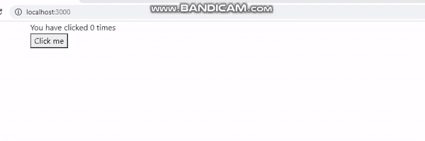

# 【useEffect 在 ReactJS 中是如何工作的？

> 原文:[https://www . geeksforgeeks . org/how-useeffect-works-in-reactjs/](https://www.geeksforgeeks.org/how-useeffect-works-in-reactjs/)

当我们想要在组件的每次渲染后执行一些操作时，我们可以使用 [useEffect()钩子。](https://www.geeksforgeeks.org/reactjs-useeffect-hook/)通过使用这个 Hook，我们告诉 React 我们的组件需要在渲染后通过传递一个函数来做一些事情。React 记住我们在 useEffect()钩子中传递的函数，并在稍后执行 DOM 更新后调用它。

默认情况下，useEffect 钩子在第一次渲染后和每次更新后运行。React 在运行效果时更新 DOM。

**创建反应应用程序:**

*   **步骤 1:** 使用以下命令创建一个反应应用程序:

    ```jsx
    npx create-react-app foldername
    ```

*   **步骤 2:** 创建项目文件夹(即文件夹名)后，使用以下命令移动到该文件夹:

    ```jsx
    cd foldername
    ```

**项目结构:**如下图。


**示例:** 现在在 **App.js** 文件中写下以下代码。在这里，App 是我们编写代码的默认组件。

## App.js

```jsx
import React, { useState, useEffect } from 'react';

function App() {

  const [count, setCount] = useState(0);

  useEffect(() => {
    alert(`You clicked ${count} times`)
  });

  const handleUpdate = ()=> {
    setCount (count + 1)
  }

  return (
    <div>  
      <div>You have clicked {count} times</div>
      <button onClick={ handleUpdate} >
        Click me
      </button>
    </div>
  );
}

export default App;
```

**运行应用程序的步骤:**从项目的根目录使用以下命令运行应用程序。

```jsx
npm start
```

**输出:**现在打开浏览器，转到***http://localhost:3000/***，会看到如下输出。



**解释:**从上面的例子中我们可以看到，每当我们更新状态时，React 会重新渲染组件，就在此之后，useEffect()会钩子调用我们已经传递的函数。