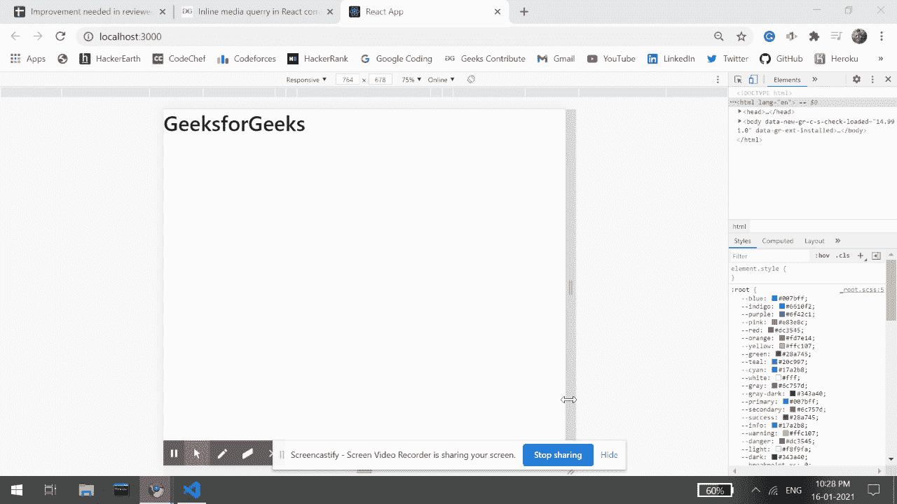

# 反应组件中的在线媒体查询

> 原文:[https://www . geesforgeks . org/inline-media-query-in-react-components/](https://www.geeksforgeeks.org/inline-media-query-in-react-components/)

一般来说，不能使用媒体查询进行内联样式，因为 React 不允许我们在内联样式中使用媒体查询。我们可以使用**镭**，这是一个第三方包，支持内联样式的媒体查询。

**创建反应应用程序:**

*   **步骤 1:** 使用以下命令创建一个反应应用程序:

    ```jsx
    npx create-react-app foldername
    ```

*   **步骤 2:** 创建项目文件夹(即文件夹名)后，使用以下命令移动到该文件夹:

    ```jsx
    cd foldername
    ```

    **项目结构:**如下图。

    

    项目结构

*   **步骤 3:** 现在在你的 **src** 文件夹中创建一个新的组件 **Example.js** ，它将返回 **GeeksforGeeks** 文本。

*   **第四步:**现在转到编辑器中的 app.js 文件进行编辑，使其返回一个组件示例(一个示例)。

*   **步骤 5:** 现在使用命令从 my-app 的根目录安装**镭**模块。

*   ```jsx
    $ npm install --save radium
    ```

    **步骤 6:** 从 app.js 和 example.js 中的 react 中导入带有{ styleroot }的镭。

*   **第七步:**最后我们可以在我们的 react 组件示例. js 中使用媒体查询，在这个示例中，我们添加了一个查询，如果设备的宽度小于 501px，那么我们的应用程序将什么都不显示。

**注意:**有一点我们必须记住，语法会略有不同，就像我们必须用 styleroot 包装我们返回的所有内容一样。

**文件名-App.js:**

## java 描述语言

```jsx
import React, { Component } from 'react'
import Radium, { StyleRoot } from 'radium';

// Importing our Example component(src folder)
import Example from './Example'

class App extends Component {
  render() {
    return (

      // Wrapping in styleroot
      <StyleRoot>
        <div className="App">
          <Example />
        </div>
      </StyleRoot>
    )
  }
}

export default Radium(App);
```

**文件名-示例. js:** 我们的组件

## java 描述语言

```jsx
import React, { Component } from 'react'
import Radium, { StyleRoot } from 'radium';
class App extends Component {
  render() {
    const style = {

      // Adding media querry..
      '@media (max-width: 500px)': {
        display: 'none',
      },
    };
    return (

      // Wrapping under styleroot.
      <StyleRoot>
        <div className="App">
          <h1 style={style}>GeeksforGeeks</h1>
        </div>
      </StyleRoot>
    )
  }
}

export default Radium(App);
```

**运行应用程序的步骤:**从项目的根目录使用以下命令运行应用程序:

```jsx
npm start
```

**输出:**您将在浏览器屏幕上看到以下输出:



现在检查窗口并将宽度减少到 501 像素，现在将看不到 **GeeksforGeeks** ，这就是如何在 React 应用程序中内联使用媒体查询。