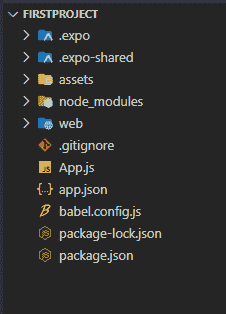

# 反应原生

简介

> 原文:[https://www.geeksforgeeks.org/introduction-react-native/](https://www.geeksforgeeks.org/introduction-react-native/)

如果你想同时为安卓和 iOS 构建移动应用。你应该学什么？每个应用程序各自的原生语言，即安卓的 Java 和 iOS 的 Swift/Objective-C？事实上，不是。原生安卓和 iOS 开发非常不同，可能会很昂贵——首先，语言本身非常不同，其次，所有底层应用编程接口都不同——使用全球定位系统的方式不同，创建动画的方式不同，进行网络调用的方式不同。

我们一直在寻求更短的开发周期、更快的部署时间和更好的应用性能。还有很多混合移动框架，比如 NativeScript、React Native、ion、Xamarin、PhoneGap 等等。

**React Native:** 这是一个由脸书开发的框架，用于在一种通用语言 JavaScript 下为 iOS &安卓系统创建本地风格的应用程序。最初，脸书只开发了 React Native 来支持 iOS。然而，随着最近对安卓操作系统的支持，该库现在可以为两个平台渲染移动用户界面。

**先决条件:**

*   [HTML](https://www.geeksforgeeks.org/html-tutorials/)[CSS](https://www.geeksforgeeks.org/css-tutorials/)[JS](https://www.geeksforgeeks.org/javascript-tutorial/)基础知识。
*   [ReactJS](https://www.geeksforgeeks.org/react-js-introduction-working/) 基础知识。
*   node.js 应该安装在您的系统中

使用 React Native 构建非常高效，并且非常容易上瘾，但是开始可能有点棘手。React Native 使用 [Node.js](https://nodejs.org/) ，一个 JavaScript 运行时，来构建你的 JavaScript 代码。如果你还没有安装 Node.js，那么是时候获取它了！

**安装:**在这里，我们将使用 Expo CLI 版本，它将更加流畅地运行您的 React Native 应用程序。按照以下步骤逐一设置您的 React 原生环境。

*   **第一步:**打开你的终端，运行下面的命令。

    ```
    npm install -g expo-cli
    ```

*   **步骤 2:** 现在 expo-cli 已全局安装，因此您可以通过运行以下命令来创建项目文件夹。

    ```
    expo init "projectName"
    ```

*   **步骤 3:** 现在进入创建的文件夹，使用以下命令启动服务器。

    ```
    cd "projectName"
    npm start web
    ```

**项目结构:**


**示例:**

## App.js

```
import  React from 'react';
import { Text, View, StyleSheet } from 'react-native';
import Constants from 'expo-constants';

const Home=()=>{
  return (
      <Text style={{
                    marginTop:300,
                    marginLeft:10}}>
          Geeksforgeeks
      </Text>
  )
}

export default function App() {
  return (
    <View>
          <Home/>
    </View>
  );
}
```

**输出:**


**相对于其他框架和语言的优势:**每当用 Swift/Objective-C 或 Java 编写的应用程序有更新时，整个应用程序都需要重新编译，新版本必须再次分发到 App Store。根据应用商店的审查流程，所有这些可能需要几周时间。

为了避免这种麻烦，React Native 应用程序以不同的方式工作，一个原生应用程序能够定位特定的 JavaScript 代码，这些代码随后会在应用程序在实际设备上启动时下载并编译。这样，更新应用程序就可以立即完成，而不需要一次又一次地向应用商店提交新版本。

要知道【React Native 是如何工作的？可以访问这篇文章。