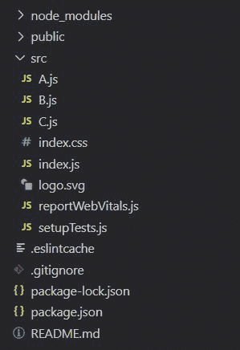

# 在反应堆中提升状态

> 原文:[https://www.geeksforgeeks.org/lifting-state-up-in-reactjs/](https://www.geeksforgeeks.org/lifting-state-up-in-reactjs/)

**先决条件** : [ReactJs](https://www.geeksforgeeks.org/react-js-introduction-working/) 、[状态](https://www.geeksforgeeks.org/reactjs-state-react/)、[道具](https://www.geeksforgeeks.org/reactjs-props-set-1/)

**提升状态:**我们知道，React 中的每个组件都有自己的状态。因此，有时数据可能是冗余和不一致的。因此，通过提升状态，我们将父组件的状态作为唯一的真实来源，并将父组件的数据传递给其子组件。

**如果“父组件和子组件”或“表亲组件”中的数据不同步，使用“提升状态”的时间:**。

**示例 1:** 如果我们的 App 中有 2 个组件。 **A - > B** 其中，A 是 B 的父级。在组件 A 和 B 中保持相同的数据可能会导致数据不一致。

**示例 2:** 如果我们的 App 中有 3 个组件。

```
        A
       / \
      B   C
```

其中 A 是 B 和 C 的父级。在这种情况下，如果 B 组件中只有一些数据，但是 C 组件也想要这些数据。我们知道组件 C 不能访问数据，因为一个组件只能和它的父组件或子组件(而不是表兄弟)对话。

**问题:**让我们用一个简单但通用的例子来实现它。我们正在考虑第二个例子。

**完整的文件结构:**



**方法:**为了解决这个问题，我们将组件 B 和组件 C 的状态提升到组件 a，通过改变 App 在 index.js 文件中的路径，使 A.js 成为我们的主父

**之前:**

```
import App from './App';
```

**之后:**

```
import App from './A';
```

**文件名- A.js:**

## java 描述语言

```
import React,{ Component }  from 'react';
import B from './B'
import C from './C'

class A extends Component {

  constructor(props) {
    super(props);
    this.handleTextChange = this.handleTextChange.bind(this);
    this.state = {text: ''};
  }

  handleTextChange(newText) {
    this.setState({text: newText});
  }

  render() {
    return (
        <React.Fragment>
          <B text={this.state.text} 
             handleTextChange={this.handleTextChange}/>
          <C text={this.state.text} />
        </React.Fragment>
    );
  }
}

export default A;
```

**文件名- B.js:**

## java 描述语言

```
import React,{ Component } from 'react';

class B extends Component {

constructor(props) {
    super(props);
    this.handleTextChange = this.handleTextChange.bind(this);
}

handleTextChange(e){
    this.props.handleTextChange(e.target.value);
}

render() {
    return (
        <input value={this.props.text} 
               onChange={this.handleTextChange} />
    );
}
}

export default B;
```

**文件名- C.js:**

## java 描述语言

```
import React,{ Component } from 'react';

class C extends Component {

render() {
    return (
        <h3>Output: {this.props.text}</h3>
    );
}
}

export default C;
```

**输出:**现在，组件 C 可以通过组件 a 访问组件 B 中的文本。

