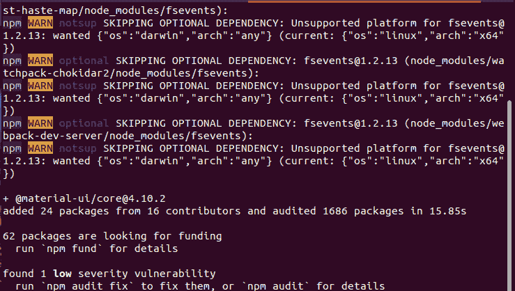

# 反作用材料界面介绍及安装

> 原文:[https://www . geesforgeks . org/material-ui-introduction-and-installation-for-react/](https://www.geeksforgeeks.org/material-ui-introduction-and-installation-for-react/)

**Material UI** 是通过添加设计和动画来构建应用程序并将其用于科技创新的最强大、最高效的工具。它基本上是谷歌在 2014 年开发的一种设计语言。它使用更多的设计和动画，网格系统，并提供阴影和闪电效果。

它可以和所有的 JavaScript 框架如[](https://www.geeksforgeeks.org/introduction-to-angularjs/)**[](https://www.geeksforgeeks.org/vue-js-introduction-installation/)**一起使用，也可以和 [ReactJS](https://www.geeksforgeeks.org/react-js-introduction-working/) 这样的库一起使用，让应用程序更加的惊艳和响应。GitHub 上有超过 35，000 颗星，Material UI 是 React 的顶级用户界面库之一。****

******Material UI 的特点:** Material UI 提供了名为**【风格功能】**的低级实用功能，用于构建强大的设计系统。****

*   ****直接从组件道具访问主题值。****
*   ****鼓励 UI 一致性。****
*   ****毫不费力地写出反应灵敏的风格。****
*   ****使用任何主题对象。****
*   ****压缩后小于千字节。****
*   ****足够快地执行。****

******先决条件:******

*   ****像(VS 代码、Atom、崇高等)这样的代码编辑器。****
*   ****应该安装 NodeJS。
    [**在 Windows 上安装 node . js**](https://www.geeksforgeeks.org/installation-of-node-js-on-windows/)
    [**在 linux 上安装 node . js**](https://www.geeksforgeeks.org/installation-of-node-js-on-linux/)****
*   ****[**创建 react app 的知识。**T3】](https://www.geeksforgeeks.org/reactjs-setting-development-environment/)****

******安装:**要安装 Material UI，请在工作目录中运行以下命令。****

*   ****使用新产品导入安装物料界面****

```
**npm install @material-ui/core** 
```

*   ****使用纱线安装材料界面****

```
**yarn add @material-ui/core** 
```

********

******示例:**在本例中我们将在 **App.js 中进行更改，**我们将导入 Material UI 并放置一个原色按钮。****

## ****超文本标记语言****

```
**import React, {Component} from 'react';
import './App.css';
import Button from '@material-ui/core/Button';

class App extends Component {
  render(){
    return (
      <div className="App">
        <br />
        <Button variant="contained" color="primary"
                size="large">
            GeeksforGeeks
        </Button>    
    </div>

    );
  }

}

export default App;**
```

******输出:******

********