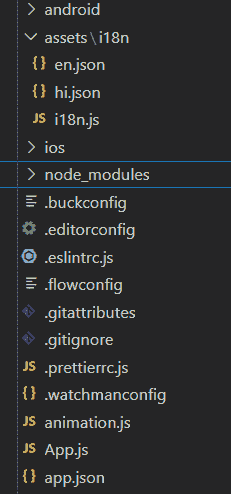
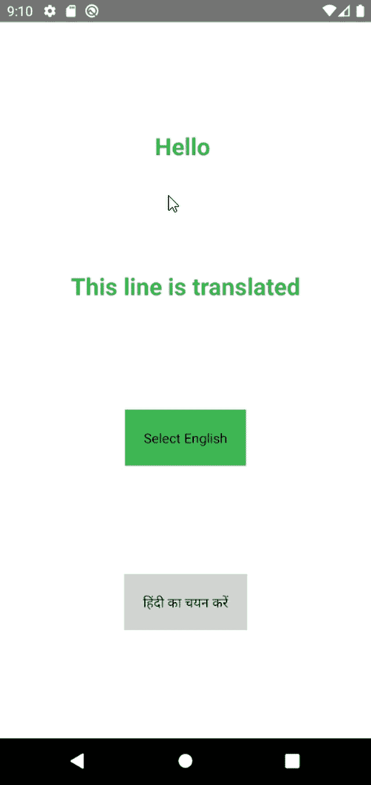

# React Native 中的多语言支持

> 原文:[https://www . geesforgeks . org/多语言支持-in-react-native/](https://www.geeksforgeeks.org/multi-language-support-in-react-native/)

**React Native 中的多语言支持:**React Native 应用的国际化帮助我们锁定那些不会说英语或者更愿意使用本地语言的用户。我们可以让用户从我们的应用程序中提供的多种语言中进行选择。

对于这种情况，我们需要在我们的应用程序中实现多语言支持。这就是 **i18next** 和**反应的地方——i18 next**派上了用场。这个库使管理翻译变得更容易，并提供了许多有用的功能。

**进场:**

*   创建新的 **React Native** 项目并安装 **i18next** 和 **react-i18next** 依赖项。
*   为每种语言创建一个 JSON 文件。
*   在 **i18n.js** 中配置 i18next。
*   通过导入 **App.js** 初始化 **i18next** 。
*   在 **App.js** 中导入语言功能，更改语言。

现在让我们从实现开始。

**步骤 1:** 通过运行命令创建一个新的**反应原生**项目

```
npx react-native init languageDemo
```

**第二步:**现在进入你的项目文件夹，即语言演示。

```
cd languageDemo
```

**第三步:**安装 **i18next** 和 **react-i18next** 库。

```
npm install i18next --save
npm i react-i18next
```

**项目结构:**如下图。



步骤 4 项目结构

**第 4 步:**创建 JSON 文件。JSON 文件包含我们希望显示的应用程序中每个文本的翻译。文件是 JSON 格式的，所以每个文本都有一个键。

对于不同的文本，密钥是唯一的，但是对于不同语言的相同文本，密钥是通用的。

**1。en.json:** 包含**英语**的翻译。

```
{
    "translation": {
      "hello":"Hello",
      "this line is translated":"This line is translated"
    }
  }
```

**2。hi.json:** 包含**印地语**的翻译。

```
{
    "translation": {
      "hello":"नमस्ते",
      "this line is translated":"यह पंक्ति अनुवादित है"
    }
  }
```

**步骤 5:** 配置 i18next (i18n.js)。我们将从**【i18next】**导入 **i18n** ，从**【react-i18next】**导入**initreactive 18next**。

然后我们将导入我们的 JSON 文件( **en.json** 和 **hi.json** )。

在**i18n . use(initreactive 18 next)**中，我们将 i18n 实例传递给 **react-i18next** ，这将使它通过上下文 api 对所有组件可用。

init()函数将{lng，fallbacklng，resources}的对象作为参数。

```
lng - default language
fallbackLng - Fallback language in case key is not found for any translation.
resources - JSON file for various languages.
```

**文件名:i18n.js**

## java 描述语言

```
import i18n from 'i18next';
import {initReactI18next} from 'react-i18next';
import en from './en.json';
import hi from './hi.json';

i18n.use(initReactI18next).init({
  lng: 'en',
  fallbackLng: 'en',
  resources: {
    en: en,
    hi: hi,
  },
  interpolation: {
    escapeValue: false // react already safes from xss
  }
});

export default i18n;
```

**第 6 步:**我们现在将导入 **App.js** 文件中的 **i18n.js** ，该文件将初始化 **i18next** 。然后我们将从 **react-i18next** 导入 **useTranslation** Hook，这给了我们 **t** 和 **i18n** 。

```
t - function which accepts key as parameter and returns the 
    appropriate text based on current language selected.
i18n - object containing function like changeLanguage  
    and other useful values.
```

在我们的屏幕上，我们有两个改变语言的按钮。当我们按下两个按钮中的一个时，有一个文本将根据当前设置的语言进行更改。要更改语言，我们将使用 **changeLanguage** 函数，该函数接受语言资源名称作为参数，并在语言更改完成后执行回调函数。

```
We can check current language by doing console.log(i18n.language)
```

## App.js

```
import React,{useState} from 'react';
import './i18n/i18n';
import {View, Text,Pressable} from 'react-native';
import {useTranslation} from 'react-i18next';

const App = () => {

  const {t, i18n} = useTranslation();

  const [currentLanguage,setLanguage] =useState('en');

  const changeLanguage = value => {
    i18n
      .changeLanguage(value)
      .then(() => setLanguage(value))
      .catch(err => console.log(err));
  };

  return (
   <View
        style={{
          flex: 1,
          backgroundColor: 'white',
          alignItems: 'center',
          justifyContent: 'space-evenly',
        }}>
        <Text style={{fontWeight: 'bold', fontSize: 25, color: '#33A850'}}>
          {t('hello')}{' '}
        </Text>
        <Text style={{fontWeight: 'bold', fontSize: 25, color: '#33A850'}}>
          {t('this line is translated')}
        </Text>
        <Pressable
          onPress={() => changeLanguage('en')}
          style={{
            backgroundColor:
              currentLanguage === 'en' ? '#33A850' : '#d3d3d3',
            padding: 20,
          }}>
          <Text>Select English</Text>
        </Pressable>
        <Pressable
          onPress={() => changeLanguage('hi')}
          style={{
            backgroundColor:
              currentLanguage === 'hi' ? '#33A850' : '#d3d3d3',
            padding: 20,
          }}>
          <Text>हिंदी का चयन करें</Text>
        </Pressable>
      </View>
  );
};

export default App;
```

**运行应用程序的步骤:**使用以下命令启动应用程序:

```
npx react-native run-android
```

**输出:**



输出

**<u>参考:</u>**[**https://react.i18next.com/guides/quick-start**](https://react.i18next.com/guides/quick-start)