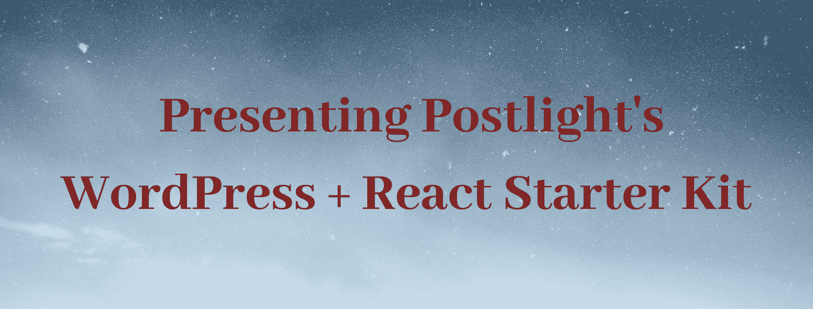

# 介绍 Postlight 的 WordPress+Reaction 入门套件

> Original: [https://www.geeksforgeeks.org/presenting-postlights-wordpress-react-starter-kit/](https://www.geeksforgeeks.org/presenting-postlights-wordpress-react-starter-kit/)

WordPress+Reaction 初学者工具包

来认识一下 Post Light 的 WordPress+Reaction Starter**Kit**，这是一个免费的、从零到圣人的工具箱，面向需要在自己的 PC 上轻松评估无头 WordPress 的架构师和物品爱好者。

这个启动单元打开一个带有响应前端的 WordPress 后端，分两个阶段与 WP REST 编程接口进行对话。 要使用它，请克隆保险库。 第一个顺序是在你的 PC 上引入和开始 WordPress，第二个顺序是开始一个响应前端的循环。 从那时起，您就可以开始从您自己的 WordPress 站点引入信息，并根据您自己的需要更改后端和前端。

Post Light 在过去一年左右的时间里为我们的客户发送了几个带有响应前端的无头 WordPress 项目，我们厌倦了不断地重复底层的跑腿工作。 这个入门包将设置无头的所有手动步骤电脑化。 我们在内部使用它来开始新的 WordPress 任务，并且我们把它做得足够传统，让您也可以这样做。

**商业案例：为什么选择无头 WordPress？**

在与不同客户的合作中，我们看到了一些情况、业务原因和项目必备条件，这些都是 WordPress 后端具有响应前端的好兆头。

您的文章群知道并热爱 WordPress，但是您的项目和技术团队需要利用当前的网站改进工具和标准来构建站点或潜在的便携应用程序。

您需要将站点的前端与后端隔离，以分离基础的基本部分，并使其更强大、适应性更强。

你需要你的 WordPress 站点的前端快速且功能强大。 (这在很大程度上取决于您的具体设计，但我们看到，随着前端响应的进展，客户站点的反应时间大幅缩短。)

你的项目和设计团队需要专注于前端发展和解决与你的业务明确相关的新问题，并影响 WordPress 目前提供的董事会安排的所有实质内容。

您的内容并不都在 WordPress 上。 您的站点或应用程序需要使用几个 API 进行对话，您的 WordPress 内容只是其中之一，而使用 JavaScript 前端来实现这一点会更简单。

**你准备把你的站点从 WordPress 移到另一个解耦的 CMS，但是需要零敲碎打地这么做--**

首先是前端，然后是后端。 在紧凑的时间表下，你正在构建一个全新的 JavaScript-put site，在没有任何准备的情况下，你没有机会制造为它提供动力的 CMS。

因为 REST 编程接口出现在 WordPress 中心才一年左右，所以无头 WordPress 在特定情况下的响应功能非常出色。 尽管如此，就像任何创新安排一样，也是有权衡的。

我们已经与需要完全远离 WordPress 的客户合作，将 PHP 和 MySQL 从他们的堆栈中移除，而这是无头 WordPress 无法解决的问题。 到目前为止，你还在运行 WordPress，这意味着你应该拥有并保持它，以及你正在使用的任何模块，并明确地对编程接口服务的内容以及它的工作方式进行一些定制。 Headless WordPress 要求你在你的设计团队中有一些 WordPress/PHP 的能力，但是你可以将这些工作分离给后台工程师，解放你的前端能力，让你可以忽略 WordPress 的内部活动，只需记住如何查询 WP 编程接口。

**专门的细微之处：如何做无头 WordPress？**

**当你克隆 Postlight 的 WordPress+Reaction 初学者工具包时，你会得到附带的：**一个引导中心 WordPress 建立的安装程序内容。

**注意：**本内容在本地介绍了 MySQL 和 WordPress，我们发现虚拟机在理念上很出色，但实际操作起来却很平庸和笨拙。

在 WordPress 模块中，您必须设置自定义帖子类型和自定义字段(进度自定义字段母版和自定义帖子类型 UI)。

WordPress 模块，在 WP REST 编程接口(ACF 到 WP 编程接口和 WP-REST 编程接口 V2 菜单)中发现那些自定义字段和 WordPress 菜单。

所有初学者 WordPress 主题代码和设置都需要无标题，包括相当不错的固定链接，CORS 允许开始标题，此外还有用于简单调查的有价值的日志记录功能。 这是一个利用 WP MOVE DB Master 在网络上的任何地方有效地从当前 WordPress 机构引入信息的工具，它将与模块一起使用(需要许可)。

由 Next.js 控制的起始前端响应应用程序。 对于一些 WordPress 控制的地区来说，网站设计改进(网站改进)是首要任务，而一些网络爬虫程序(如 Google News)无法解析非常规 HTML 的目的地。 Js 使工作者端的响应交付变得简单，这样您就可以获得交付的 HTML 页面的网站设计增强优势，就像客户端响应的可能结果一样。

**注意：**对于范围较小的区域设置，静态站点生成器或简单的客户端响应可以满足您的所有项目需求。

一个前端应用程序 Docker 包厢和用于监督它的内容，用于有效地将其传送给任何使用 Docker Hained 的便利供应商(AWS 多功能 Beanstrik、Google Cloud 或现在通常都是令人难以置信的替代方案)。

有很多方法可以设置和设计无头 WordPress，还有无数的响应库和结构，你可以在前台使用它们来完成你的工作。 这个初学者单元讲述了我们在 Postlight 做这件事的一种方式的基础，接受这一建议，使用你喜欢的，扔掉你不喜欢的，并根据你的必需品重新做这件事。