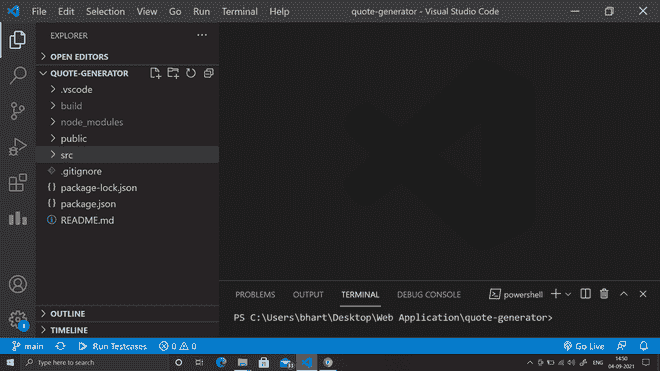
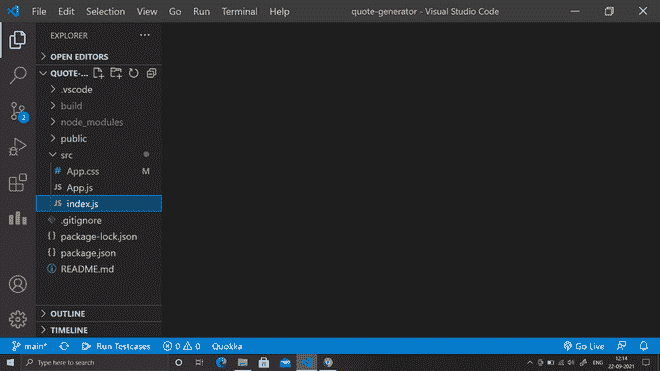
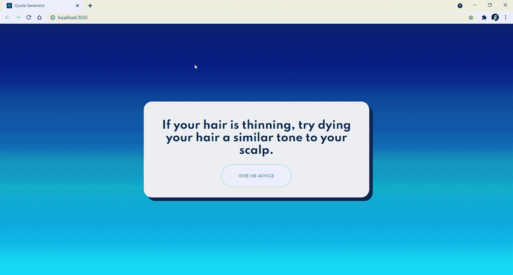

# 使用 ReactJS

的随机报价生成器应用

> Original: [https://www.geeksforgeeks.org/random-quote-generator-app-using-reactjs/](https://www.geeksforgeeks.org/random-quote-generator-app-using-reactjs/)

Reaction 是一个用于开发交互式用户界面的 JavaScript 库。 它由 Facebook 和一个由个人开发者和公司组成的社区管理。 Reaction 主要专注于开发单页网页或移动应用程序。 在这里，我们将创建一个 Random Quote Generator App 来了解 ReactJS 的基础知识。

**方法：**通过本文，我们将从头开始创建一个完整的 Reaction 应用程序。 这个应用程序将使用 API 来实际放置一些数据，这些数据将是随机引号。 我们将从头开始创建一个有趣的 ReactJS API 数据获取项目-A Reaction 随机报价生成器 App。 我们将在前端使用 REACTION，并向建议条 JSON API 发出 GET 请求。 阅读完本文后，您将对 Reaction 的基本工作流程以及如何在 Reaction Apps 中发出 API 请求有一个深刻的理解。 了解如何使用 Reaction js 获取 API 数据。

**建议单 JSON 接口：**https://api.adviceslip.com/

**需要的模块：**

*   NPM
*   作出反应 / 敌视 / 反对 / 产生不良心理反应

**基本设置：**通过以下命令启动项目：

**npx：npx**它是 npm 5.2+附带的一个包运行器工具，npx 很容易使用 CLI 工具。 Npx 用于执行节点包。 它极大地简化了许多事情，其中之一是快速检查/运行节点包，而无需在本地或全局安装它。

**第一步：**通过以下命令创建 Reaction 应用

```
npx create-react-app quote-generator-react
```

**步骤 2：**现在，转到文件夹

```
cd quote-generator-react
```

**项目结构：**如下所示。

Src 文件夹将主要包含 3 个文件：

*   Index.js
*   App.js
*   App.css



**步骤 3：**现在在 src 文件夹中为我们的随机引用生成器应用程序创建一个 index.js 文件。



**第四步：**编辑 public 内部的 index.html 文件，更改 App 标题。

**index.html**

## 超文本标记语言

```
<!DOCTYPE html>
<html lang="en">

<head>
    <meta charset="utf-8" />
    <link rel="icon" href="%PUBLIC_URL%/favicon.ico" />
    <meta name="viewport" content=
        "width=device-width, initial-scale=1" />
    <meta name="theme-color" content="#000000" />
    <meta name="description" content=
        "Web site created using create-react-app" />
    <link rel="apple-touch-icon" 
        href="%PUBLIC_URL%/logo192.png" />

    <!--Fonts-->
    <link rel="preconnect" href="https://fonts.gstatic.com" />
    <link href=
"https://fonts.googleapis.com/css2?family=Spartan:wght@100;200;300;
            400;500;600;700;800;900&display=swap" 
            rel="stylesheet" />

    <title>Quote Generator</title>
</head>

<body>
    <noscript>
        You need to enable JavaScript 
        to run this app.
    </noscript>
    <div id="root"></div>
</body>

</html>
```

**第 5 步：编辑 src 中的 App.js 文件。**在 App.js 中，我们将创建一个基于类的 App 组件(App 组件是 React 中的主要组件，它充当所有其他组件的容器。)。 在这个应用程序组件中，我们将有一个 State(State 就像一个包含所有最重要内容的全局对象)。 因为这是一个非常简单的对象，没有属性，所以我们可以这样写它-***state={Advisation：“}；***在这个文件中，我们使用**ComponentDidMount()**方法：ComponentDidMount()方法允许我们在组件已经放置到 DOM(文档对象模型)中时执行 Reaction 代码。 此方法在 Reaction 生命周期的安装阶段(即在呈现组件之后)调用。

***App.js***

## JavaScript

```
import React from 'react';
import axios from 'axios';

import './App.css';

class App extends React.Component {

    state = { advice: '' };

    componentDidMount() {
        this.fetchAdvice();
    }

    fetchAdvice = () => {
        axios.get('https://api.adviceslip.com/advice')
        .then((response) =>  {
            const { advice } = response.data.slip;

            this.setState({ advice });
        })

        .catch ((error) => {
            console.log(error);
        })
    }

    render() {
        const { advice } = this.state;

        return (
            <div className="app">
                <div className="card">
                    <h1 className="heading">
                      {this.state.advice}
                    </h1>
                    <button className="button" onClick=
                     {this.fetchAdvice}>
                        <span>Give Me Advice</span>
                    </button>
                </div>
            </div>
        );
    }
}

export default App;
```

**第六步：在 src 中编辑 App.css 文件。** App.css 将包含我们的随机报价生成器应用程序的样式代码。 这是与 App Component 对应的 CSS(为 App Component 设置样式)文件。

**App.css**

## CSS

```
#root, html, body {
    margin: 0;
    padding: 0;
    height: 100vh;
    box-sizing: border-box;
  }

  .app {
    height: 100%;
    background: linear-gradient( rgba(9, 9, 121, 100), 
                rgba(0, 212, 255, 100) );
    background-size: cover;
    background-position: center;
    display: flex;
    justify-content: center;
    align-items: center;
    text-align: center;
  }

  .card {
    background: whitesmoke;
    width: 40%;
    height: 30%;
    display: flex;
    align-items: center;
    flex-direction: column;
    border-radius: 25px;
    padding: 2%;
    box-shadow: 10px 10px;
  }

  .heading {
    display: flex;
    align-items: center;
    height: 350px;
    font-family: 'Spartan', sans-serif;
  }

  .button {
    position: relative;
    outline: none;
    text-decoration: none;
    border-radius: 50px;
    display: flex;
    justify-content: center;
    align-items: center;
    cursor: pointer;
    text-transform: uppercase;
    height: 200px;
    width: 210px;
    opacity: 1;
    background-color: #ffffff;
    border: 1px solid rgba(22, 76, 167, 0.6);
  }

  .button span {
    color: #164ca7;
    font-size: 12px;
    font-weight: 500;
    letter-spacing: 0.7px;
  }

  .button:hover {
    animation: rotate 0.7s ease-in-out both;
  }

  .button:hover span {
    animation: storm 0.7s ease-in-out both;
    animation-delay: 0.06s;
  }

  @keyframes rotate {
    0% {
      transform: rotate(0deg) translate3d(0, 0, 0);
    }
    25% {
      transform: rotate(3deg) translate3d(0, 0, 0);
    }
    50% {
      transform: rotate(-3deg) translate3d(0, 0, 0);
    }
    75% {
      transform: rotate(1deg) translate3d(0, 0, 0);
    }
    100% {
      transform: rotate(0deg) translate3d(0, 0, 0);
    }
  }

  @keyframes storm {
    0% {
      transform: translate3d(0, 0, 0) translateZ(0);
    }
    25% {
      transform: translate3d(4px, 0, 0) translateZ(0);
    }
    50% {
      transform: translate3d(-3px, 0, 0) translateZ(0);
    }
    75% {
      transform: translate3d(2px, 0, 0) translateZ(0);
    }
    100% {
      transform: translate3d(0, 0, 0) translateZ(0);
    }
  }  

  @media only screen and (max-width: 1007px) {
    .card {
        width: 60%;
        height: 30%;
    }
  }

  @media only screen and (max-width: 600px) {
    .card {
        width: 80%;
        height: 40%;
    }
  }
```

**运行应用程序的步骤：**打开终端，键入以下命令。

```
npm start
```

**输出：**在浏览器中打开 http://localhost:3000/：



使用 Reaction 的报价生成器应用程序

**GitHub 链接：**[HTTPS：//github.com/bhartik021/QUOTE-GENERATOR](https://github.com/bhartik021/quote-generator)